# Báo cáo kỹ thuật: hệ thống Crawl + Bóc tách + Tìm kiếm hust.edu.vn

Môn Tích hợp dữ liệu — IT5420. Tài liệu này mô tả **công nghệ dùng** và **cách
hệ thống hoạt động ở mức code**, dùng để báo cáo kỹ thuật. Nguồn là mã nguồn
trong `hust-crawler/` và `hust-search/`. Chỗ nào là ước lượng hay chưa kiểm
chứng thì ghi rõ ngay tại chỗ.

Sơ đồ viết bằng **Mermaid**: GitHub tự vẽ khi xem file. Trình soạn thảo không
hỗ trợ Mermaid thì dán khối code vào https://mermaid.live để xem.

**Mục lục**

1. [Tổng quan kiến trúc](#1-tổng-quan-kiến-trúc)
2. [Crawl](#2-crawl--công-nghệ-và-cách-hoạt-động)
3. [Bóc tách nội dung](#3-bóc-tách-nội-dung--khối-trường-đồ-thị)
4. [Tệp tài liệu và ảnh](#4-tệp-tài-liệu-và-ảnh)
5. [Lưu trữ MongoDB](#5-lưu-trữ-mongodb)
6. [Đánh chỉ mục và tìm kiếm (Lucene)](#6-đánh-chỉ-mục-và-tìm-kiếm--lucene)
7. [Tầng API và giao diện](#7-tầng-api-và-giao-diện)
8. [Kiểm thử](#8-kiểm-thử)
9. [Giới hạn đã biết](#9-giới-hạn-đã-biết)
10. [Bản đồ file](#10-bản-đồ-file-để-tra-cứu-nhanh)

---

## 1. Tổng quan kiến trúc

Hệ thống gồm hai project, nối với nhau bằng file trên đĩa. `hust-crawler/` chạy
độc lập (hoặc làm service `crawler` trong docker). `hust-search/` là một project Java chạy trong **một
tiến trình** (service `search`); cùng với `crawler` và `mongo` thành stack docker ba dịch vụ ở `docker-compose.yml`
(thư mục gốc repo).

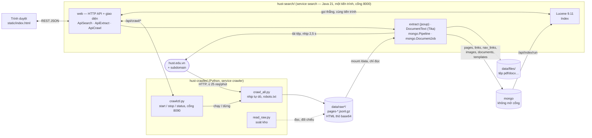

**Nguyên tắc xuyên suốt: tách phần đắt (tải trang, bị chặn nhịp) khỏi phần rẻ
và hay phải sửa (bóc tách, đánh chỉ mục, xếp hạng).** Crawler chỉ ghi HTML thô,
không parse. Bóc tách, ghi Mongo và index có thể chạy lại bao nhiêu lần cũng
không tốn thêm request nào tới hust.edu.vn.

Dữ liệu đi qua bốn tầng, mỗi tầng một dạng:

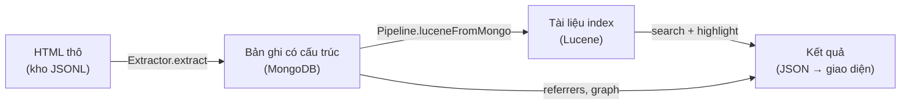

**Phân chia theo ngôn ngữ:**

| Ngôn ngữ | Việc | Vì sao |
|---|---|---|
| Python (`requests`, `BeautifulSoup4`, `lxml`) | Crawl thô; `crawlctl.py` điều khiển qua HTTP | Kiểm soát chính xác nhịp gọi; khử trùng đặc thù NukeViet |
| Java 21 (`jsoup`, Apache Tika, `mongodb-driver-sync`) | Bóc tách HTML, đồ thị liên kết, bóc chữ tệp, ghi Mongo | Một tiến trình với phần tìm kiếm, khỏi chặng HTTP giữa hai tầng; `Url.java` là bản sao của `crawl_all.norm()` / `dedup_key()` (kiểm bằng golden 100%) |
| Java 21 (`Lucene 9.11` core, không Elasticsearch/Solr) | Đánh chỉ mục, tìm, xếp hạng, highlight | Đề bài yêu cầu dùng Lucene thuần |
| Java (`com.sun.net.httpserver`) | Điều phối: chuyển tiếp lệnh crawl, chạy job nền, phục vụ giao diện | Lớp mỏng, virtual thread cho mỗi yêu cầu |

Bản đầu của hệ thống viết tầng bóc tách + điều phối bằng Python (FastAPI) rồi port sang Java ngày 03/10/2026
(`hust-search/KE-HOACH-PORT-JAVA.md`): hợp đồng HTTP giữ nguyên, thuật toán và hằng số giữ nguyên.

---

## 2. Crawl — công nghệ và cách hoạt động

### 2.1. Công nghệ dùng

| Thành phần | Công nghệ | File |
|---|---|---|
| Tải trang (đường chính) | `requests` (Session + connection pool) | `crawl_all.py` |
| Parse HTML để tìm link/phân trang | `BeautifulSoup4` + `lxml` | `crawl_all.py` |
| Tuân thủ robots.txt | `urllib.robotparser.RobotFileParser` | `crawl_all.py` |
| Lưu trữ thô | JSON Lines nén `gzip`, chia shard theo số dòng | `Store` trong `crawl_all.py` |
| Trạng thái/resume | `state.json` | `crawl_all.py` |
| Render JS khi `requests` lấy hụt | **Playwright** (Chromium headless) | `render.py` |
| Wrapper có parse (17 trường) | `BeautifulSoup4` + microdata schema.org | `crawl_hust.py` |
| Đọc/soát kho | thuần Python | `read_raw.py` |

Không dùng framework crawl có sẵn (Scrapy…) vì hai lý do: cần kiểm soát chính
xác nhịp gọi (site chặn khắt khe, xem 2.4) và cần logic khử trùng đặc thù của
NukeViet (2.5).

### 2.2. Cấu trúc site mục tiêu

hust.edu.vn chạy **NukeViet 4** (nhận diện qua cookie `nv4s_*`).

| Nguồn | Vị trí | Đặc điểm |
|---|---|---|
| Sitemap | `/sitemap.xml` → 34 sitemap con theo chuyên mục × ngôn ngữ | có `<lastmod>`, nhưng bị cắt ở 1000 url cho `news`, 7 sitemap rỗng |
| Trang danh mục | `/vi/news/<slug>/page-N/`, 6 bài/trang | `div.news_column div.panel-body` |
| Metadata bài | microdata `[itemprop=headline\|author\|datePublished\|dateModified\|image]` | gắn với dữ liệu nên ít đổi theo giao diện |
| Nội dung bài | `div.bodytext` | |
| Khoá bài (sai lầm ban đầu) | đuôi url `...-654601.html` | **không duy nhất** — xem 2.5 |

### 2.3. Vòng đời crawl (BFS có ưu tiên)

Lớp `Crawler` giữ ba cấu trúc lõi:

```python
self.frontier: collections.deque   # hàng đợi (url, depth, via) chưa tải
self.queued:   set[str]            # MỌI url đã từng vào hàng đợi — chống lặp
self.done:     dict[str, int]      # url -> HTTP status đã tải
```

**`push(url, depth, via)`** là cổng vào duy nhất của hàng đợi:

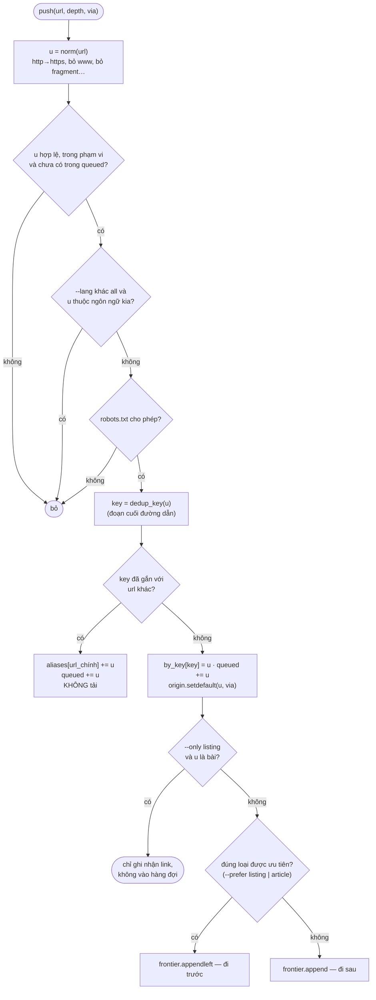

Mặc định ưu tiên trang danh mục (phủ hết chuyên mục trước, danh sách url đầy
đủ sớm nhất). `--prefer article` đảo lại để có bài đọc được ngay nếu phải dừng
giữa chừng. Lý do có hai chế độ là bài học thực tế: một mẻ dở dang toàn trang
danh mục thì kho gần như chưa có bài nào.

**Vòng lặp chính `run()`:**

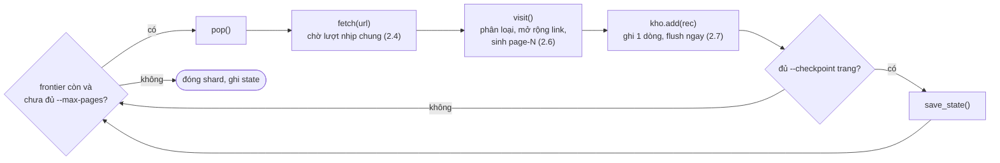

`visit()` luôn quét mọi `<a href>` của trang vừa tải để đẩy thêm url nội bộ —
"lưới vét cuối cùng": trang nào có người trỏ tới thì cuối cùng cũng được thăm.

### 2.4. Nhịp tự dò (rate limiting)

**Đo được:** hust.edu.vn chặn ở khoảng **20-25 request/phút**, vượt là HTTP 429
kèm `Retry-After: ~30`. Ngưỡng đo bằng cách bắn thử ở các nhịp khác nhau rồi đếm
số 429 — site không công bố.

**Lỗi ban đầu:** mỗi luồng tự `sleep` riêng khi dính 429 rồi ùa vào lại, nên lúc
nào cũng có một luồng đang "chịu phạt". Tốc độ thực chỉ 0,55 trang/s dù đặt
2,2 request/s. Profiler (`sample <pid>` trên macOS) cho thấy 100% luồng nằm trong
`time.sleep`.

**Cơ chế hiện tại:** một khoá `pace` chung cho mọi luồng, cùng hai biến chung
`_next_at` (lượt kế tiếp) và `_pause_until` (nghỉ phạt).

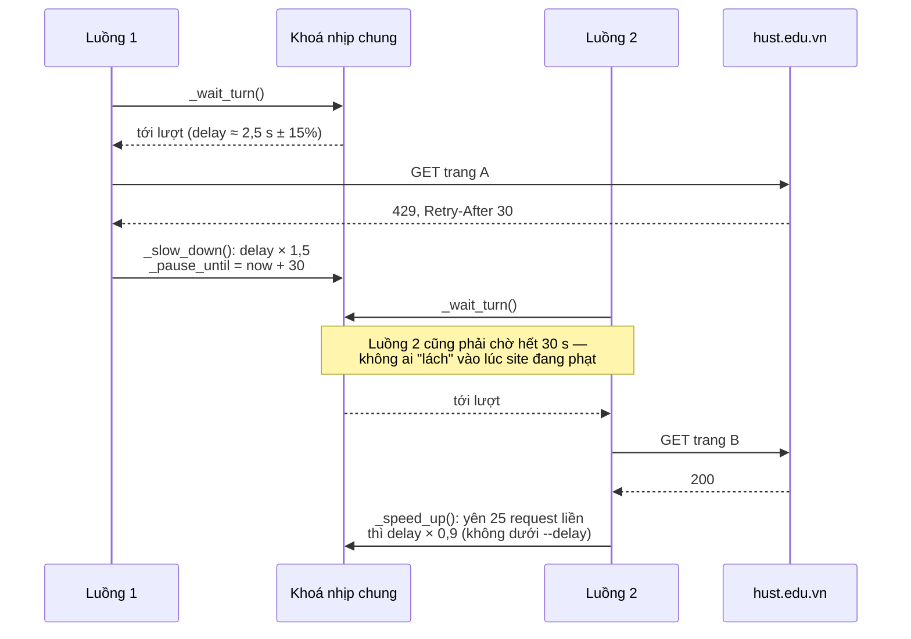

429 không tính là lỗi của url (không mất bài, không tăng đếm lỗi), chỉ là tín
hiệu phải chờ. Kết quả đo: ổn định ~24 trang/phút, 0 lần 429 ở các mẻ gần nhất.
`--workers` mặc định 2 vì nhịp đã khoá chung — thêm luồng không nhanh hơn.

### 2.5. Khử trùng bài viết — bài toán entity resolution

NukeViet in cùng một bài dưới nhiều url tuỳ chuyên mục người dùng đang đứng
(`/su-kien-noi-bat/...` và `/khoa-hoc-cong-nghe-dmst/...`). Không khử trùng thì
~45% request là tải lại nội dung đã có.

**Giả định sai ban đầu:** dùng con số cuối url (`art_id()`, ví dụ `654601`) làm
khoá. Đo thực tế thấy **ba bài khác hẳn nhau** cùng mang đuôi `-654601.html` —
hậu quả 159 bài thật bị đánh dấu nhầm là bí danh và không được tải.

**Khoá đúng — `dedup_key()`:** lấy **đoạn cuối đường dẫn** (slug kèm số), bỏ phần
chuyên mục ở giữa. Kiểm chứng hai chiều bằng cách tải thật và so `sha1` phần
nội dung:

| Giả thuyết | Kiểm chứng | Kết quả |
|---|---|---|
| Cùng đoạn cuối, khác chuyên mục = một bài | so `sha1(bodytext)` | giống hệt → đúng |
| Cùng con số cuối, khác slug = một bài | so tiêu đề + độ dài | khác hẳn → sai |

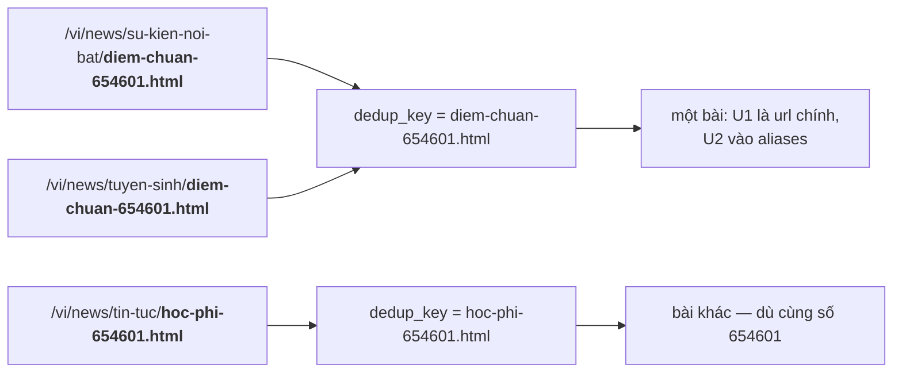

Bài học đúng tinh thần entity resolution: **một trường trông như ID chưa chắc
là ID — phải kiểm chứng bằng nội dung.** Hai bảng trong `state.json`:
`by_key` (khoá → url chính) và `aliases` (url chính → các url phụ, không tải).
Tầng bóc tách (3.6) dùng lại đúng `dedup_key()` để gộp bản trùng trong Mongo.

### 2.6. Phân trang — đọc số trang cuối, không "bấm trang sau"

NukeViet luôn in link tới trang phân trang cuối trong HTML (dù widget rút gọn
phần giữa thành `...`). `expand_pagination()` chỉ cần **một** trang gốc chuyên
mục:

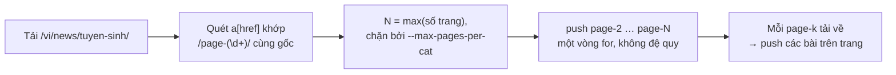

Chạy lại trên các `page-k` đã tải cho ra 0 url mới (đã nằm trong `queued`) — đó
là lưới an toàn: chuyên mục nào không in số trang cuối thì BFS từ trang giữa vẫn
tự bù, chỉ chậm hơn. Crawler nhận 6 khuôn phân trang (`/page-N/`, `/page/N/`,
`?page=N`, `?paged=N`, `/trang-N/`, `/pN/`) và dùng đúng khuôn trang tự in ra,
nên chạy được trên CMS subdomain khác mà không sửa code — đã thử trên
`svbk.hust.edu.vn` (có sitemap) và `library.hust.edu.vn` (không sitemap, tự suy ra
`?page=265`).

### 2.7. Lưu trữ thô — `Store` (JSONL + gzip, chia shard)

Mỗi dòng JSONL là một trang đã tải:

```json
{"url": "...", "status": 200, "kind": "article", "article_id": "656013",
 "depth": 2, "via": "...", "fetched_at": "...", "sha1": "...",
 "encoding": "utf-8", "html_b64": "<base64 của đúng byte HTML gốc>"}
```

`html_b64` giữ **nguyên byte gốc** kèm `sha1` để đối chiếu — đổi cách bóc tách
không bao giờ phải tải lại.

**Flush từng dòng.** Bản đầu flush gzip mỗi 25 dòng; kill cứng hai lần khiến
`read_raw.py --check` thấy 184 url "đã tải theo state nhưng không có trong shard".
Thí nghiệm (ghi 400 dòng, `kill -9` ở dòng 300):

| Kiểu flush | Đọc lại được sau kill -9 |
|---|---|
| từng dòng | 301/301 |
| 25 dòng/lần | 300/301 |
| không flush | 0/301 |

Crawler bắt `SIGTERM`/`SIGHUP` để đóng shard và ghi `state.json` đúng cách. Dừng
bằng `kill -TERM <pid>`, không dùng `pkill -f` (khớp cả dòng lệnh shell và giết
nhầm terminal).

### 2.8. `state.json` — cho phép `--resume` an toàn

```json
{
  "done": {"url": 200}, "frontier": [["url", 1, "via"]],
  "queued": ["url"], "by_key": {"slug": "url_chinh"},
  "aliases": {"url_chinh": ["url_phu"]}, "assets": ["url"],
  "origin": {"url": "nơi phát hiện lần đầu"}, "errors": []
}
```

`origin` là bảng lineage riêng: `via` bị ghi đè khi tải lại (vd. qua
`--seed-file`), còn `origin` dùng `setdefault` nên luôn giữ nơi phát hiện đầu tiên.

State luôn được nạp nếu file có; `--resume` chỉ quyết định có gieo lại hạt giống
hay không. (Trước đây chạy `--from-file` thiếu `--resume` làm mất hàng đợi 4.220
url; `read_raw.py --rebuild-state` dựng lại từ shard + `N1-links`.)

### 2.9. `render.py` — Playwright khi `requests` lấy hụt (chỉ trên máy host)

Image docker của crawler đã bỏ Playwright (03/10/2026) nên trong docker `--render` không có tác dụng và
`/api/crawl/start` từ chối `render` khác `never`; muốn dùng thì chạy crawler trên máy host có cài Playwright.
Bật qua `--render auto|always|never`. `looks_blocked()` coi là "có vẻ bị chặn"
khi status 403/429/503, HTML có dấu hiệu chặn bot, hoặc trang gần như không có
link/chữ. Playwright sync API gắn với luồng tạo ra nó, nên mỗi luồng một browser
riêng qua `threading.local()`. Gặp captcha thật thì ghi nhận là bị chặn, không
tìm cách giải.

### 2.10. `crawl_hust.py` và `read_raw.py`

`crawl_hust.py` đọc lại kho thô (không tải lại) và bóc mỗi bài ra **17 trường**
phẳng (`id, url, lang, title, section, breadcrumb, author, published_at,
modified_at, summary, content, word_count, thumbnail, images, attachments,
crawled_at, lastmod, source`), xuất `.jsonl` và `.csv` (`utf-8-sig`). Đây là bản
riêng của crawler, độc lập với tầng bóc tách của `hust-search` (mục 3).

`read_raw.py` soát kho bằng nguồn độc lập:

| Lệnh | Câu hỏi trả lời | Cách làm |
|---|---|---|
| `--check` | kho và `state.json` có lệch không? | so `done` với số dòng thật trong shard |
| `--audit` | chuyên mục nào tải thiếu trang? | so trang gốc chuyên mục với các `page-N` đã tải |
| `--fix-roots` | chuyên mục nào rơi khỏi cả `done` lẫn `frontier`? | `mồ côi = queued − done − frontier − aliases`, suy ngược tập chuyên mục từ url bài |
| `--verify-links` | `N1-links` có thiếu link nào có thật trong HTML? | bóc lại mọi `href`, cả hai bên qua cùng `norm()` |
| `--rebuild-state` | cứu hộ khi `state.json` hỏng | dựng lại từ shard + `N1-links` |

Đã xảy ra: `--fix-roots` phát hiện **111 chuyên mục** biến mất khỏi kế hoạch
crawl (gồm `tin-tuc-su-kien` 295 trang) sau một lần `--seed-file` xoá frontier.
`--verify-links` từng báo "thiếu 17 link" — hoá ra lỗi ở phép đo (một bên giữ
`http://`, bên kia đổi `https://`), sửa bằng cách bắt mọi nơi gọi đúng một hàm
`norm()`.

---

## 3. Bóc tách nội dung — khối, trường, đồ thị

Nằm ở `hust-search/src/main/java/vn/hust/search/extract/`. Cửa vào duy nhất là
`Extractor.extract(html, url, khuon)`; các route chỉ giải base64 (`RawStore.decodeHtml`) rồi gọi
hàm này, nên `/api/fetch`, `/api/index/run` (nguồn kho thô) và
`/api/extract/run` (ghi Mongo) dùng **cùng một bộ bóc tách**.

### 3.1. Thứ tự các bước trong `boc_tach()`

Thứ tự có chủ ý: liên kết và JSON-LD phải lấy **trước** khi dọn cây, vì dọn cây
xoá mất `<script>` (chứa JSON-LD) và `<nav>`/`<footer>` (chứa cạnh khuôn).

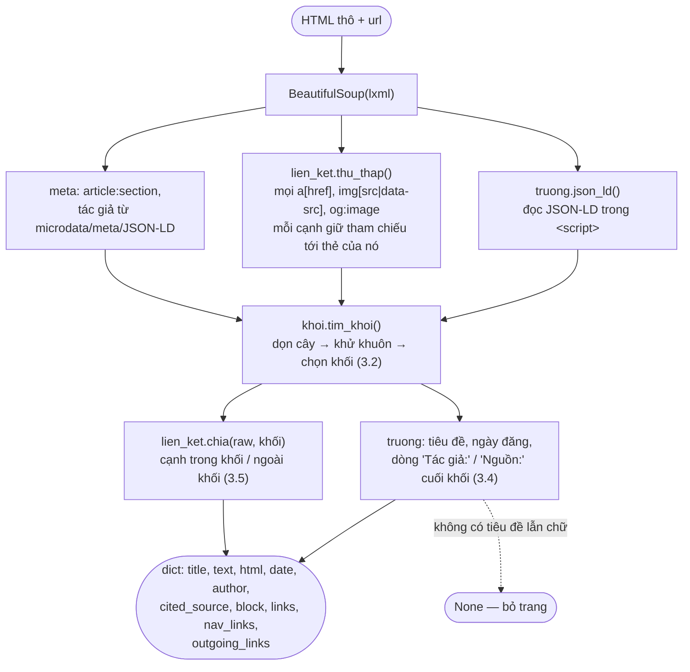

### 3.2. Thuật toán tìm khối nội dung (`ContentBlock.java`)

Ghép hai họ ý tưởng: mật độ chữ / mật độ link trên DOM (CETD — Sun, Song, Liao,
SIGIR 2011; Boilerpipe — Kohlschütter và cs., WSDM 2010) và khử khuôn theo cả site
(Site Style Tree — Yi, Liu, Li, KDD 2003). Tên bài báo ghi theo trí nhớ, cần kiểm
lại trước khi trích dẫn. Cách cài là bản đơn giản hoá tự viết, không chép mã.

**Ba lớp:**

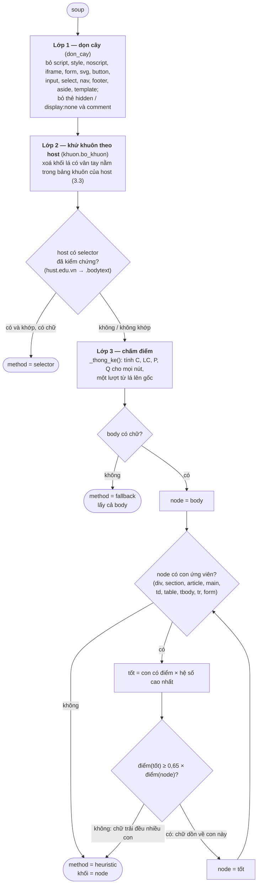

**Công thức điểm** (hằng số trong `ContentBlock.java`):

```
C  = số ký tự chữ của nút          LC = số ký tự nằm trong <a>
P  = số <p> có ≥ 25 ký tự và ≥ 1 dấu câu
Q  = số dấu câu . , ; : ? ! …

mật_độ_link = LC / max(C, 1)
điểm(n)     = (C − LC) · (1 − mật_độ_link)^α + β·P + γ·Q        α = 2, β = 30, γ = 1
hệ số tên   = ×1,3 nếu class/id khớp content|article|post|entry|detail|bodytext|main|news-body|noi-dung
              ×0,3 nếu khớp nav|menu|footer|header|sidebar|comment|share|related|breadcrumb|
                          banner|widget|social|advert|popup|modal|pagination|tag
ngưỡng đi xuống: δ = 0,65
```

Trực giác: khối nội dung có nhiều chữ thường, ít chữ trong link, nhiều đoạn văn.
Đi từ `body` xuống, mỗi bậc chọn con tốt nhất; còn giữ được ≥ 65% điểm của cha
thì đi tiếp, không thì dừng — vì khi đó chữ đang trải đều nhiều con (ví dụ thân
bài chia thành nhiều `div` anh em), chọn một con sẽ cắt mất nội dung.

Ví dụ thật trên trang mẫu WordPress tổng hợp (`tests/fixtures/html/wordpress.test/00.html`),
số lấy từ `/api/extract/explain`:

| Bậc | Cha (điểm) | Ngưỡng 65% | Con tốt nhất (điểm) | Kết luận |
|---|---|---|---|---|
| 1 | `body` (363) | 236 | `div.container` (411) | đi xuống |
| 2 | `div.container` (411) | 267 | `article.post` (832, ×1,3); `div.widget-area` chỉ 3 | đi xuống |
| 3 | `article.post` (640) | 416 | `div.entry-content` (790, ×1,3) | đi xuống — hết con ứng viên, chọn khối này |

Kết quả: còn 391/890 ký tự của trang (dọn cây bỏ 109, phần ngoài khối bỏ 390).

**Đo lường:** `BlockEvaluationTest` đo precision/recall/F1 trên túi âm tiết, so
với cả `body`. **Chỉ mới đo trên trang tổng hợp** (bộ mẫu trong test), chưa đo
trên trang thật có nhãn; bản Java khớp bản Python 100% trên 3.438 trang kho thật. Các hằng số α, β, γ, δ là khởi điểm, chưa được dò.

**Xem trực quan:** tab **Bóc tách khối** trên giao diện vẽ lại đúng các bước
này cho từng trang (mục 7.2).

### 3.3. Khử khuôn theo host (`Template.java`)

Menu, footer, banner lặp gần như nguyên xi trên mọi trang cùng site. Khối văn
bản xuất hiện trên quá nhiều trang của một host thì là khuôn.

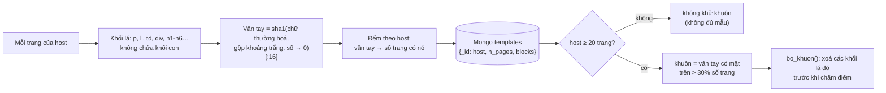

Bảng dựng một lần bằng `POST /api/extract/templates`. Để document không vượt
16 MB, chỉ lưu khối có mặt trên ≥ max(3, 5% số trang). Ngưỡng 30% và 20 trang là
khởi điểm, chưa dò trên kho thật.

### 3.4. Bóc trường của trang (`Fields.java`)

Mỗi trường là một chuỗi ưu tiên; nguồn lấy được ghi vào `*_src` để đo độ phủ.

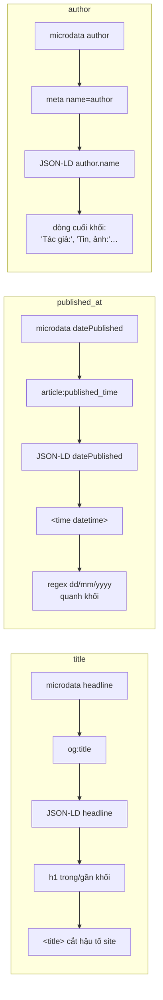

Bỏ giá trị tác giả chung chung (`admin`, `webmaster`…). Dòng "Nguồn: …" / "Theo
…" cuối bài thành trường phụ `cited_source`. Ngày chuẩn hoá về `YYYY-MM-DD`.
Độ phủ theo host xem ở `GET /api/extract/coverage`.

### 3.5. Đồ thị liên kết (`Links.java`)

**Nút** là một url (trang, tệp, ảnh, trang ngoài). **Cạnh** `A --> B : "chữ"`
nghĩa là trang A có `<a href=B>chữ</a>` (hoặc ``). Đọc ngược
mũi tên ra **nguồn giới thiệu** — nên đồ thị chính là cách trả lời yêu cầu "nguồn
giới thiệu" cho cả trang, tệp và ảnh.

Hai loại cạnh khác hẳn nhau về ý nghĩa, và thuật toán khối (3.2) là thứ tách
chúng:

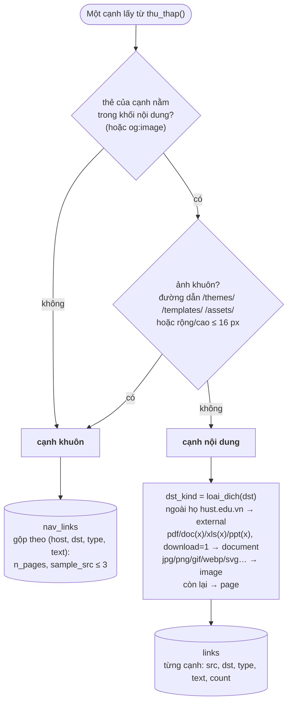

| | Cạnh nội dung (`links`) | Cạnh khuôn (`nav_links`) |
|---|---|---|
| Nằm ở | trong khối nội dung | ngoài khối, lặp trên nhiều trang |
| Ý nghĩa | người viết **chủ động** giới thiệu B | cấu trúc điều hướng của site |
| Lưu | từng cạnh theo trang | gộp mỗi host một bản, đếm số trang |

Lý do gộp cạnh khuôn: lưu theo từng trang thì mỗi link menu thành hàng nghìn
cạnh giống hệt; "nguồn giới thiệu" của `/vi/tuyen-sinh/` sẽ là danh sách hàng
nghìn trang không ai đọc được. Gộp lại thì đọc được: *"menu của hust.edu.vn, chữ
'Tuyển sinh', có trên N trang"*.

Ví dụ **minh hoạ** (url và chữ đặt ra cho dễ hình dung, không lấy từ kho thật):

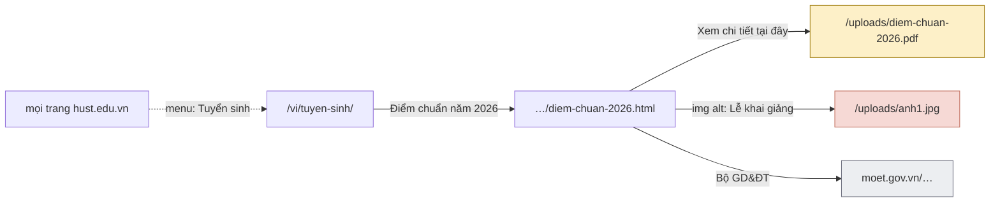

Văn bản mô tả của cạnh: chữ của `<a>` → `title` → `aria-label` → `alt` của ảnh
con; với ảnh: `alt` → `title` → `figcaption`. Mọi url đi qua `crawl_all.norm()`.
`outgoing_links` của schema public là cạnh `href` trong khối, mỗi url một dòng.

### 3.6. Ghi kho thô vào Mongo (`trich.chay_extract`)

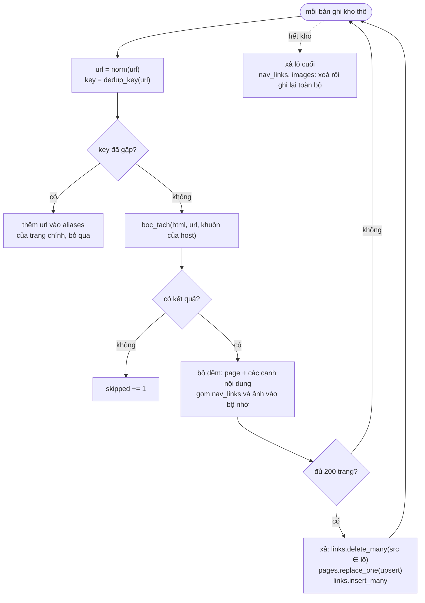

Chạy lại không nhân đôi bản ghi: `pages` ghi theo `_id`; `links` xoá theo `src`
rồi ghi lại; `nav_links` và `images` là bảng tổng hợp nên dựng lại từ đầu.

---

## 4. Tệp tài liệu và ảnh

### 4.1. Tệp tài liệu (`mongo/DocumentJob.java`, `extract/DocumentText.java`)

Ba bước, chạy nền qua API, mỗi tệp đi qua các trạng thái:

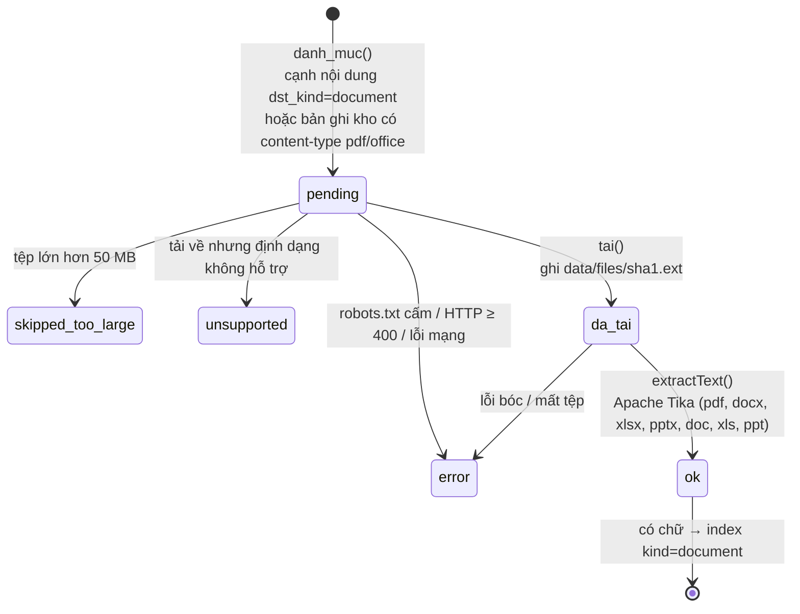

(`da_tai` là `status = pending` đã có `sha1`; trong Mongo không có trạng
thái riêng.)

- Chỉ tải host `*.hust.edu.vn`; host ngoài (Google Drive…) chỉ có cạnh trong đồ thị.
- Nhịp 2,5 s, 429 thì chờ theo `Retry-After`, tôn trọng robots.txt.
- `POST /api/files/fetch` **trả 409 khi crawler đang chạy**: hai tiến trình mỗi
  bên 2,5 s là ~48 request/phút, gấp đôi ngưỡng site chặn.
- **Không OCR.** PDF dưới 20 ký tự/trang (thường là bản scan) gắn cờ `needs_ocr` và để `text` rỗng; chữ nghi sai bảng
  mã cũ (TCVN3/VNI) gắn `encoding_suspect`. Tệp vẫn có bản ghi và nguồn giới thiệu.

### 4.2. Ảnh

Không tải ảnh — đề chỉ cần nguồn giới thiệu. `images` là danh mục: `alts` gom mọi
chữ mô tả từng gặp; `is_template = true` nếu ảnh chỉ xuất hiện ở cạnh khuôn
(logo, icon).

---

## 5. Lưu trữ MongoDB

Lược đồ ràng buộc bằng `$jsonSchema` trong `mongo-schema.json` (`mongo/Db.java` nạp), tạo lúc `search` khởi động; đã được MongoDB thật kiểm (`integration_bt.sh`, `MongoTest`).
Mô tả đầy đủ từng trường ở `hust-search/SCHEMA.md`.

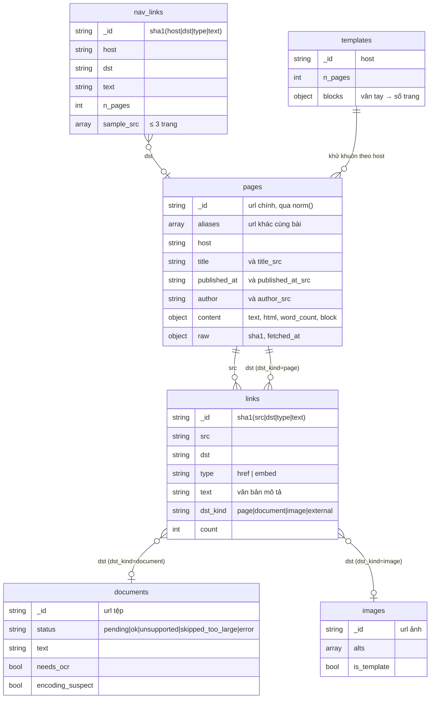

Nguồn giới thiệu của một url bất kỳ là hai truy vấn một bước:

```js
db.links.find({dst: "<url>"}, {src: 1, text: 1})                     // ai giới thiệu trong bài
db.nav_links.find({dst: "<url>"}, {host: 1, text: 1, n_pages: 1})    // menu nào trỏ tới
```

`GET /api/referrers` tự đổi bí danh về trang chính trước khi truy vấn. Không chép
mảng "referrers" vào từng bản ghi — nguồn sự thật là `links` + `nav_links`, nạp
lại không bị lệch.

**Vì sao MongoDB:** Lucene không hợp để lưu quan hệ "ai trỏ tới ai". Các truy vấn
đề bài cần (cạnh vào một bước, đếm bậc, xuất CSV) đều là truy vấn một bước. Phân
tích nhiều bước (đường đi, PageRank) thì xuất `GET /api/graph/edges.csv` sang
networkx/Gephi. So sánh với các lựa chọn khác ở `hust-search/KE-HOACH-BOC-TACH.md` mục 8.

**Đã kiểm chứng (03/10/2026):** `MongoTest` và `integration_bt.sh` chạy trên MongoDB 7.0 thật và kho thật,
kể cả việc `$jsonSchema` từ chối bản ghi sai (bản Python dùng `mongomock` nên chưa từng thử được điều này).

---

## 6. Đánh chỉ mục và tìm kiếm — Lucene

### 6.1. Công nghệ dùng

| Thành phần | Công nghệ | File |
|---|---|---|
| Lõi tìm kiếm | **Apache Lucene 9.11.1** thuần | `lucene/` |
| Ngôn ngữ | Java 21 | |
| HTTP | `com.sun.net.httpserver` có sẵn trong JDK | `SearchServer.java` |
| JSON | Jackson `jackson-databind` 2.17.2 | |
| Build | Maven, jar mỏng + `lib/` (**không shade** — 6.7) | `pom.xml` |

### 6.2. Nạp index

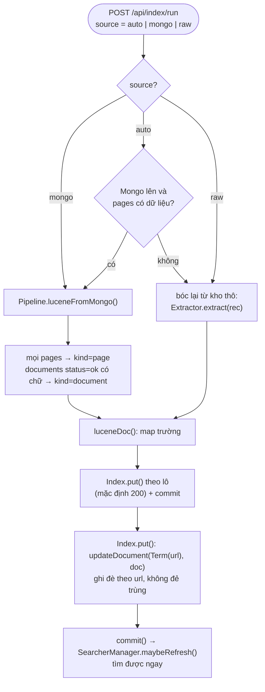

`POST /api/index/documents` nhận thẳng corpus JSON theo schema public (không qua
crawler) — dùng cho demo độc lập với mạng (`tests/fixtures/corpus.json`, tối đa
5.000 tài liệu/request, validate viết tay trong `ApiSearch.PublicDocument`, sai schema → 422). `POST /api/fetch` tải một url,
bóc, ghi kho `raw-adhoc`, ghi Mongo và index ngay; máy chủ giữ ≥ 3 giây giữa hai
lần tải.

### 6.3. Schema tài liệu Lucene (`Index.java`)

| Trường | Kiểu | Lưu | Ý nghĩa |
|---|---|---|---|
| `url` | `StringField` | có | khoá cập nhật |
| `title`, `text` | `TextField`, `StandardAnalyzer` | có | bản **còn dấu** |
| `title_kd`, `text_kd` | `TextField`, analyzer bỏ dấu | không | bản **bỏ dấu**, để khớp truy vấn không dấu |
| `host` | `StringField` + `SortedDocValuesField` | có | lọc theo site, đếm theo host |
| `section` | `TextField` | có | chuyên mục |
| `author` | `TextField` | có | tác giả — hiện chỉ lưu và hiển thị, chưa đưa vào truy vấn |
| `kind` | `StringField` | có | `page` / `document`, lọc được |
| `date` / `date_num` | `StringField` / `LongPoint` + `NumericDocValuesField` | có / không | hiển thị; lọc khoảng và sắp theo ngày (`0` = không rõ) |
| `sig` | `StoredField` | có | vân tay SimHash 64-bit (6.6) |
| `html` | `StoredField` | có | HTML đã dọn, chỉ để xem trước |

Mỗi trường chữ index hai lần (còn dấu / bỏ dấu) bằng `PerFieldAnalyzerWrapper`.
`Fold.bo_dau()` tự viết: chuẩn hoá NFD, bỏ ký tự `NON_SPACING_MARK`, xử lý tay
`đ`/`Đ` (NFD không tách được). Hai bản dùng chung `StandardTokenizer` nên token
cùng vị trí, truy vấn cụm chạy đúng trên cả hai.

### 6.4. Một lượt tìm kiếm

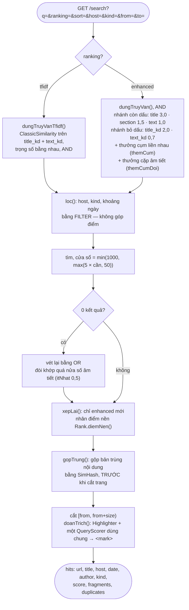

**Chế độ `tfidf`** (mặc định) là TF-IDF cổ điển thuần, dùng để trình bày đúng
thuật toán, không pha tín hiệu ngoài.

**Chế độ `enhanced`** thêm: hai nhánh còn dấu / bỏ dấu (gõ đủ dấu thì cả hai cùng
khớp nên luôn xếp trên); thưởng cụm vì `StandardAnalyzer` cắt tiếng Việt theo âm
tiết ("kỹ thuật" thành 2 token); thưởng từng cặp âm tiết liền nhau cho câu dài; và
nhân điểm nền `Rank.diemNen()` theo loại trang (`/page-N/` 0,50 · cửa vào chuyên
mục 0,70 · bài `.html` 1,00), độ dài (`0,75 + 0,25 × min(1, ký_tự/1200)`) và độ mới
(`0,92 + 0,16 × e^(−tuổi/3)`). Biên độ cố ý nhẹ (~0,35×).

**Vét lại khi không ra gì:** ngưỡng "quá nửa" chứ không phải OR trần (OR trần khớp
đúng một âm tiết phổ biến sẽ lôi về hàng nghìn bài), và không phải 2/3 (mỗi từ
tiếng Việt 2 âm tiết bị gõ thừa đã chiếm 2/4 token của câu ngắn).

### 6.5. Highlight

Tô `<mark>` làm ở Lucene, không ở trình duyệt: Lucene biết chính xác token nào
khớp sau khi phân tích. `Highlighter` và `SimpleSpanFragmenter` phải dùng **chung
một** `QueryScorer` — tạo hai cái thì cái của fragmenter không bao giờ được init và
ném `NullPointerException`.

### 6.6. Gộp bản trùng — SimHash (`Sig.java`)

Cùng một bài được phát ở `/vi/news/...` và `/vi/news/savefile/...`, lệch vài chữ ở
phần khung trang — băm thường cho hai giá trị khác hẳn.

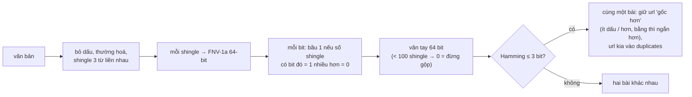

Ngưỡng 3 bit đo thực nghiệm: từ 106 shingle trở lên, hai bản của cùng một bài
(thêm khung trang) lệch đúng 3 bit; hai bài khác chủ đề lệch từ 18 bit.

### 6.7. Vấn đề build — Lucene 9 là multi-release JAR

`maven-shade-plugin` làm mất `META-INF/versions/19/` (chứa
`MemorySegmentIndexInputProvider`), chạy trên Java 21 ném `LinkageError` khi mở
index. `pom.xml` build jar mỏng + `maven-dependency-plugin` chép jar phụ thuộc vào
`lib/`, classpath khai trong manifest.

### 6.8. `SearchServer.java`

`HttpServer` của JDK, `Executors.newFixedThreadPool(8)`. Endpoint: `/bulk`,
`/search`, `/list`, `/dict`, `/posting`, `/doc`, `/stats`, `/reset`, `/health`.
Lỗi cú pháp truy vấn trả **400** chứ không phải 500.

---

## 7. Tầng API và giao diện

### 7.1. Job nền và dây chuyền bóc tách

Các việc dài (dựng khuôn, bóc tách, tải tệp, bóc chữ) chạy trên một luồng nền,
**mỗi lúc một job** (`_chay_nen`, gọi trùng trả 409). Tiến độ đọc ở
`GET /api/extract/status`; số liệu từng bước ở `GET /api/extract/overview`.

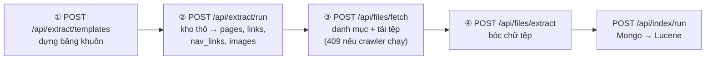

Bước ① không bắt buộc (không có bảng khuôn thì lớp 2 bỏ qua), nhưng nên chạy
trước ② để khử khuôn có hiệu lực.

### 7.2. Giao diện (`hust-search/static/index.html`)

Một file tĩnh, không framework, không bước build. Đồ thị và biểu đồ vẽ bằng SVG/CSS
tự viết, không tải thư viện ngoài.

```mermaid
flowchart LR
    subgraph UI["Các tab"]
        T1["Tìm kiếm"]
        T2["Tải một trang"]
        T3["Duyệt tất cả"]
        T4["Chỉ mục ngược"]
        T5["Bóc tách khối"]
        T6["Đồ thị liên kết"]
        T7["Tệp &amp; ảnh"]
        T8["Bảng điều khiển"]
    end
    T1 --> E1["/api/search · /api/preview"]
    T2 --> E2["/api/fetch"]
    T3 --> E3["/api/index/list"]
    T4 --> E4["/api/index/dict · /posting"]
    T5 --> E5["/api/extract/explain"]
    T6 --> E6["/api/referrers · /api/graph/out<br/>/api/graph/stats · edges.csv"]
    T7 --> E7["/api/files · /api/images"]
    T8 --> E8["/api/stats · /api/crawl/*<br/>/api/index/* · /api/extract/*"]
    T1 -. "nút Nguồn giới thiệu" .-> T6
    T1 -. "nút Khối nội dung" .-> T5
    T5 -. "Xem đồ thị quanh trang" .-> T6
    T6 -. "Xem khối của trang" .-> T5
```

Ba phần vẽ trực quan cho bóc tách và đồ thị:

- **Bóc tách khối** (`/api/extract/explain`): chạy lại bước chọn khối trên HTML thô
  trong kho (không gọi lại site; có Mongo thì dùng thêm bảng khuôn). Vẽ ① phễu số
  ký tự còn lại sau mỗi lớp, ② các bậc đi xuống cây — thanh điểm của cha và từng con,
  vạch ngưỡng 65%, câu kết luận "đi xuống" / "dừng", ③ thanh chia liên kết trong khối
  (cạnh nội dung) / ngoài khối (cạnh khuôn). `tim_khoi()` nhận tham số `vet` tuỳ
  chọn để ghi các bậc này; không truyền thì kết quả như cũ (có test).
- **Đồ thị liên kết:** đồ thị hình sao bằng SVG — trái là trang trỏ tới, giữa là url
  đang xem, phải là nơi nó trỏ đi; màu theo loại đích, menu/footer nét đứt; tối đa
  12 ô mỗi cột, phần dư gộp "+N nữa"; bấm một ô để chuyển tâm. Dạng bảng vẫn còn
  trong "Xem dạng bảng".
- **Bảng điều khiển:** bốn bước ở 7.1 vẽ thành dải ô nối mũi tên, mỗi ô ghi số liệu
  đã có, sáng viền khi đang chạy.

Ảnh chụp các phần này đã chạy trên stack với kho thật (API khớp mẫu bản Python);
giao diện chưa được rà lại bằng mắt sau khi port. `/api/extract/explain` phải quét kho thô để tìm HTML của url
(có lọc thô bằng chuỗi trước khi giải mã JSON); chưa đo tốc độ trên kho ~200 MB.

### 7.3. Đóng gói Docker

```yaml
services:                       # docker-compose.yml ở thư mục gốc repo, name: hust-search
  search:  build ./hust-search, depends_on mongo (healthy), cổng 8000, -Xmx1g
           volumes: lucene-index:/index, ./hust-crawler/data:/data, ./hust-search/static:/app/static
  crawler: build ./hust-crawler, KHÔNG mở cổng (chỉ search gọi crawlctl.py:8090)
           volumes: ./hust-crawler:/app   (sửa crawl_all.py không cần build lại)
  mongo:   image mongo:7.0, volume mongo-data, KHÔNG mở cổng (chưa có xác thực)
```

Image `crawler` không có Playwright. `docker compose down` (không `-v`) giữ nguyên volume index và Mongo.

---

## 8. Kiểm thử

| Bộ test | Số lượng | Công cụ | Việc kiểm |
|---|---|---|---|
| Engine crawler | 32 | `pytest` | `norm`, `dedup_key`, `expand_pagination`, nhịp, flush, resume |
| Java (`hust-search`) | 115 | JUnit 5 (+ `-Pstack`: 2 test `ApiGoldenTest`) | `Url` khớp golden 100%; đọc kho; bóc tách khớp bản Python trên 3.438 trang kho thật; Tika; Mongo THẬT (`$jsonSchema`); HTTP (`ApiTest`, `ExtractUrlTest`); index, tìm, highlight, gộp trùng, xếp hạng (`IndexTest` 31) |
| Tích hợp tìm kiếm | 33 kiểm tra | bash `tests/integration.sh` | đường đi thật trên stack đang chạy |
| Tích hợp bóc tách | 19 kiểm tra | bash `tests/integration_bt.sh` | job nền, Mongo thật, đồ thị, tệp, validator — đã chạy 19/19 trên kho thật |

Quy ước: mỗi test đặt tên theo đúng lỗi thật đã gặp — test nào đỏ thì đọc tên là
biết vừa phá lại chuyện gì.

**Đã chạy (03/10/2026)** trên stack docker với MongoDB thật và kho thật: `extract/run` cả kho (3.627 trang)
12-21 s, `index/run` 2 s, RSS của `search` ~690 MB. Hình dạng phản hồi khớp 71 mẫu của bản Python và
overlap@10 của 25 truy vấn × 2 ranking đạt 0,97. **Chưa đo:** độ chính xác thuật toán khối trên trang thật
(chỉ có độ khớp với bản Python, không có nhãn vàng).

---

## 9. Giới hạn đã biết

**Crawler**
- Subdomain: mới crawl link bên trong 2/51 host (`library`, `svbk`); phần lớn host
  khác chỉ có link "cửa vào" từ trang chính.
- Đường tải chính không chạy JavaScript; Playwright đã bỏ khỏi docker nên trang dựng bằng JS (vd. `work.hust.edu.vn`) không crawl được trong stack.
- Ngưỡng nhịp đo tại một thời điểm; nhịp tự dò tự chỉnh nhưng không tức thời.

**Bóc tách**
- Thuật toán khối chỉ mới đo trên trang tổng hợp; hằng số chưa dò.
- Không OCR (PDF scan gắn `needs_ocr`); `doc/xls/ppt` cũ đọc được bằng Tika/POI; không tải tệp ở host ngoài.
- `nav_links` có thể phình (gồm cả liên kết ngoài khối nhưng riêng từng trang, vd.
  "tin liên quan"); chưa đo trên kho thật.

**Tìm kiếm**
- `StandardAnalyzer` tách tiếng Việt theo âm tiết, chưa tách từ ghép (chỉ bù bằng
  thưởng cụm ở `enhanced`).
- `author` và chữ mô tả của cạnh đi vào (anchor text) chưa được dùng để xếp hạng;
  đồ thị chưa dùng làm tín hiệu kiểu PageRank.
- Không có xác thực — cổng 8000 mở không mật khẩu, chỉ dùng máy cá nhân hoặc
  mạng nội bộ.

---

## 10. Bản đồ file để tra cứu nhanh

| Muốn hiểu/sửa gì | File | Hàm/lớp chính |
|---|---|---|
| Vòng lặp crawl, hàng đợi | `hust-crawler/crawl_all.py` | `Crawler.run/push/pop/fetch/visit` |
| Nhịp tự dò | `hust-crawler/crawl_all.py` | `_wait_turn/_slow_down/_speed_up` |
| Khử trùng bài | `hust-crawler/crawl_all.py` | `dedup_key()` — KHÔNG dùng `art_id()` |
| Phân trang | `hust-crawler/crawl_all.py` | `expand_pagination()`, `PAGE_PATTERNS` |
| Lưu trữ thô | `hust-crawler/crawl_all.py` | `Store` |
| Render JS | `hust-crawler/render.py` | `looks_blocked()` |
| Soát kho | `hust-crawler/read_raw.py` | `--audit/--check/--fix-roots/--verify-links` |
| Cửa vào bóc tách | `hust-search/src/main/java/vn/hust/search/extract/Extractor.java` | `extract()`, `explain()` |
| Chọn khối nội dung | `extract/ContentBlock.java` | `findBlock()`, `nodeScore()`, `ALPHA/BETA/GAMMA/DELTA` |
| Khử khuôn | `extract/Template.java` | `fingerprint()`, `templateSet()`, `removeTemplate()` |
| Tiêu đề / ngày / tác giả | `extract/Fields.java` | `title()`, `publishedDate()`, `authorMeta()` |
| Đồ thị liên kết | `extract/Links.java` | `collect()`, `split()`, `destKind()` |
| Bóc chữ tệp | `extract/DocumentText.java`, `mongo/DocumentJob.java` | `extractText()`, `catalog()`, `download()` |
| Chuẩn hoá url (bản sao `crawl_all`) | `store/Url.java` | `norm()`, `dedupKey()`, `kindOf()` |
| Kho thô | `store/RawStore.java`, `store/Download.java` | `allRecords()`, `findRecord()`, `append()` |
| Kho thô → Mongo, Mongo → Lucene | `mongo/Pipeline.java` | `runExtract()`, `buildTemplates()`, `luceneFromMongo()` |
| Lược đồ Mongo | `mongo/Db.java`, `mongo-schema.json`, `SCHEMA.md` | `init()` |
| Route bóc tách/đồ thị/tệp | `web/ApiExtract.java` | `/api/extract/*`, `/api/referrers`, `/api/graph/*`, `/api/files` |
| Route index/tìm/tải lẻ/crawl | `web/ApiSearch.java`, `web/ApiCrawl.java`, `hust-crawler/crawlctl.py` | `indexRun`, `indexDocuments`, `fetch`, `search` |
| Schema Lucene, xếp hạng | `hust-search/lucene/.../Index.java` | `put()`, `dungTruyVanTfidf/dungTruyVan`, `loc()`, `gopTrung()` |
| Điểm nền | `hust-search/lucene/.../Rank.java` | `diemNen()` |
| Bỏ dấu | `hust-search/lucene/.../Fold.java` | `bo_dau()` |
| SimHash | `hust-search/lucene/.../Sig.java` | `fingerprint()`, `distance()`, `sameArticle()` |
| HTTP Lucene | `hust-search/lucene/.../SearchServer.java` | — |
| Giao diện | `hust-search/api/static/index.html` | `veKhoi()`, `veDoThiSao()`, `veDayChuyen()` |
| Đóng gói | `hust-search/docker-compose.yml`, `lucene/pom.xml` | — |
