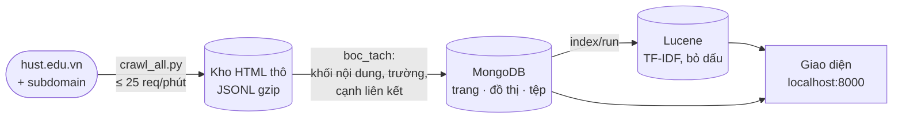

# di-project — Crawl, bóc tách và tìm kiếm hust.edu.vn

Bài tập môn Tích hợp dữ liệu (IT5420). Thu thập cổng thông tin Đại học Bách khoa
Hà Nội, bóc tách nội dung và đồ thị liên kết vào MongoDB, đánh chỉ mục và tìm kiếm
bằng Apache Lucene thuần, xem và điều khiển qua giao diện web.



## Bố cục

| Thư mục | Nội dung |
|---|---|
| `hust-crawler/` | engine crawl + công cụ soát kho, chạy độc lập không cần docker. Dữ liệu ở `hust-crawler/data/` (gitignored) |
| `hust-search/` | stack docker: `lucene` (Java 21 + Lucene 9.11), `api` (FastAPI + giao diện + bóc tách), `mongo` |

## Chạy nhanh

```bash
# crawler
cd hust-crawler
python3 -m venv .venv && .venv/bin/pip install -r requirements.txt
.venv/bin/python read_raw.py --stats                 # kho đang có gì
.venv/bin/python crawl_all.py --resume --prefer article

# stack tìm kiếm
cd ../hust-search
docker compose up -d --build                         # mở http://localhost:8000
./tests/integration.sh
```

Lần đầu Mongo và index rỗng: vào tab **Bảng điều khiển**, chạy bốn bước bóc tách
rồi bấm **Index thêm vào kho** (chi tiết ở `hust-search/README.md` mục 1).

## Đọc gì ở đâu

| Tài liệu | Dành cho |
|---|---|
| [`BAO-CAO-KY-THUAT.md`](BAO-CAO-KY-THUAT.md) | báo cáo kỹ thuật: kiến trúc, **sơ đồ luồng dữ liệu và từng thuật toán** (crawl, nhịp tự dò, khử trùng, chọn khối, khử khuôn, đồ thị liên kết, tệp, tìm kiếm, SimHash), kiểm thử, giới hạn |
| [`hust-search/README.md`](hust-search/README.md) | chạy stack, API, giao diện, test, chỗ từng hỏng, sửa ở đâu |
| [`hust-search/SCHEMA.md`](hust-search/SCHEMA.md) | lược đồ MongoDB, sơ đồ quan hệ, trạng thái tệp |
| [`hust-search/KE-HOACH-BOC-TACH.md`](hust-search/KE-HOACH-BOC-TACH.md) | kế hoạch bóc tách, các quyết định đã chốt, tiến độ |
| [`hust-crawler/README.md`](hust-crawler/README.md) | crawler: chạy gì tiếp, số liệu kho, khảo sát site, kỹ thuật tìm lỗi |
| [`hust-crawler/CHIA-DU-LIEU.md`](hust-crawler/CHIA-DU-LIEU.md) | đóng gói và chuyển kho dữ liệu cho người khác |

Sơ đồ viết bằng Mermaid, GitHub tự vẽ. Trình xem khác thì dán khối code vào
https://mermaid.live.

## Trạng thái

- Kho: 2.070 trang / 201 MB HTML thô, 5.640 bài đã phát hiện, còn ~4.216 bài chưa
  tải (số liệu ghi ngày 22/08/2026 trong `CLAUDE.md`).
- Subdomain: mới crawl link bên trong 2/51 host.
- Test: 32 (crawler) + 64 (pytest phía api) + 30 (JUnit Lucene); tích hợp
  `integration.sh` (33 kiểm tra) và `integration_bt.sh`.
- **Chưa chạy** phần bóc tách trên MongoDB thật với kho thật; thuật toán chọn khối
  mới đo trên trang mẫu tổng hợp.
