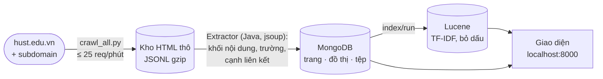

# di-project — Crawl, bóc tách và tìm kiếm hust.edu.vn

Bài tập môn Tích hợp dữ liệu (IT5420). Thu thập cổng thông tin Đại học Bách khoa
Hà Nội, bóc tách nội dung và đồ thị liên kết vào MongoDB, đánh chỉ mục và tìm kiếm
bằng Apache Lucene thuần, xem và điều khiển qua giao diện web.



## Bố cục

| Thư mục | Nội dung |
|---|---|
| `hust-crawler/` | engine crawl + công cụ soát kho, chạy độc lập không cần docker. Dữ liệu ở `hust-crawler/data/` (gitignored) |
| `hust-search/` | project Maven Java 21, **một tiến trình**: HTTP API + giao diện + bóc tách (jsoup, Tika) + MongoDB + Lucene 9.11 |
| `docker-compose.yml` | stack ba dịch vụ: `search` (Java, cổng 8000), `crawler` (Python, `crawlctl.py`, không mở cổng), `mongo` (không mở cổng) |

## Chạy nhanh

```bash
# crawler
cd hust-crawler
python3 -m venv .venv && .venv/bin/pip install -r requirements.txt
.venv/bin/python read_raw.py --stats                 # kho đang có gì
.venv/bin/python crawl_all.py --resume --prefer article

# stack tìm kiếm (từ thư mục gốc repo)
cd ..
docker compose up -d --build                         # mở http://localhost:8000
hust-search/tests/integration.sh
```

Lần đầu Mongo và index rỗng: vào tab **Bảng điều khiển**, chạy bốn bước bóc tách
rồi bấm **Index thêm vào kho** (chi tiết ở `docs/hust-search.md` mục 1).

## Đọc gì ở đâu

Mọi tài liệu nằm trong [`docs/`](docs/).

| Tài liệu | Dành cho |
|---|---|
| [`docs/BAO-CAO-KY-THUAT.md`](docs/BAO-CAO-KY-THUAT.md) | báo cáo kỹ thuật: kiến trúc, **sơ đồ luồng dữ liệu và từng thuật toán** (crawl, chế độ mới nhất theo ngày, nhịp tự dò, khử trùng, chọn khối, khử khuôn, đồ thị liên kết, tệp, tìm kiếm, SimHash), kiểm thử, giới hạn |
| [`docs/hust-search.md`](docs/hust-search.md) | chạy stack, API, giao diện, test, chỗ từng hỏng, sửa ở đâu |
| [`docs/SCHEMA.md`](docs/SCHEMA.md) | lược đồ MongoDB, sơ đồ quan hệ, trạng thái tệp |
| [`docs/THUAT-TOAN-BOC-TACH.md`](docs/THUAT-TOAN-BOC-TACH.md) | thuật toán chọn khối, khử khuôn, bóc trường, đồ thị liên kết, có ví dụ chạy thật |
| [`docs/so-do-luong-du-lieu.html`](docs/so-do-luong-du-lieu.html) | sơ đồ một trang: từ HTML thô tới kết quả tìm kiếm |
| [`docs/hust-crawler.md`](docs/hust-crawler.md) | crawler: chạy gì tiếp, số liệu kho, khảo sát site, kỹ thuật tìm lỗi |
| [`docs/CHIA-DU-LIEU.md`](docs/CHIA-DU-LIEU.md) | đóng gói và chuyển kho dữ liệu cho người khác |

Sơ đồ viết bằng Mermaid, GitHub tự vẽ. Trình xem khác thì dán khối code vào
https://mermaid.live.

## Trạng thái

- Kho: 2.070 trang / 201 MB HTML thô, 5.640 bài đã phát hiện, còn ~4.216 bài chưa
  tải (số liệu ghi ngày 22/08/2026 trong `CLAUDE.md`).
- Subdomain: mới crawl link bên trong 2/51 host.
- Test: 34 (pytest crawler) + 115 (JUnit `hust-search`, thêm 2 `ApiGoldenTest` với `-Pstack`);
  tích hợp `integration.sh` (33 kiểm tra) và `integration_bt.sh` (19).
- Bóc tách đã chạy trên MongoDB thật với kho thật (03/10/2026); bản Java khớp bản Python cũ
  100% trên 3.438 trang. Độ chính xác thuật toán chọn khối mới đo trên trang mẫu tổng hợp.
- Crawler có thêm chế độ `recent` (lấy bài theo khoảng ngày đăng, đọc ngày ngay trên trang danh
  sách) — chọn ở tab **Bảng điều khiển** hoặc `crawl_all.py --since/--until`.
