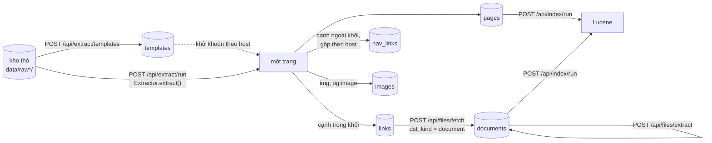
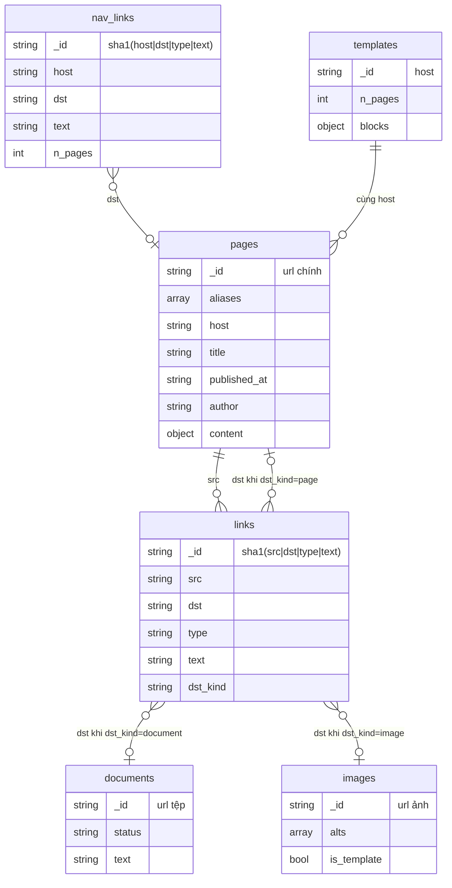
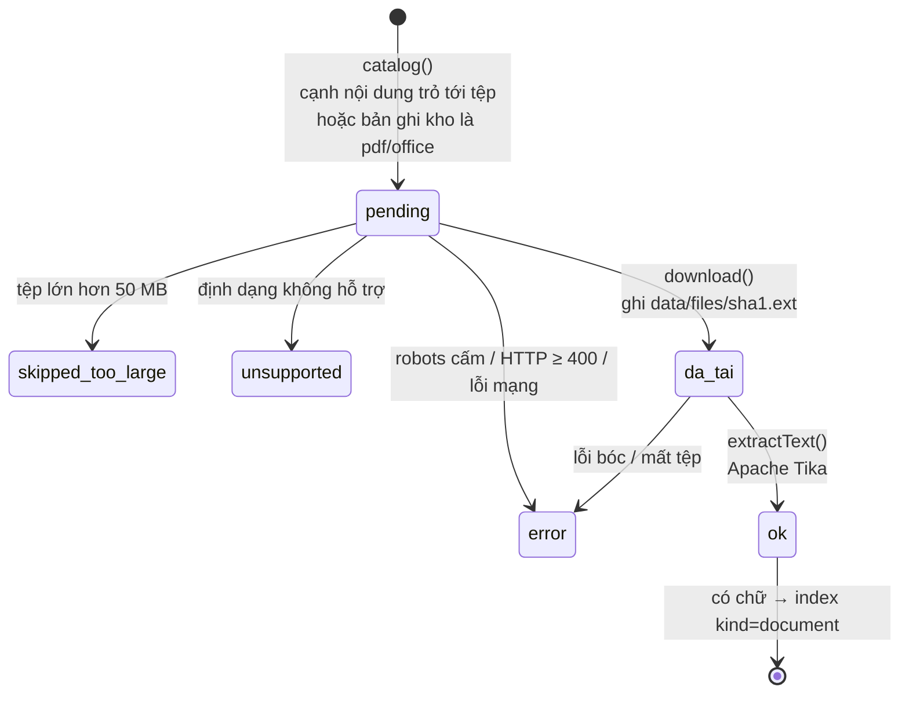

# Lược đồ MongoDB (phần "tự xây dựng lược đồ + mô tả" của đề)

Ràng buộc `$jsonSchema` (khoá `schemas`) và các index (khoá `indexes`) nằm ở
`hust-search/src/main/resources/mongo-schema.json`; `mongo/Db.java` (`init()`) nạp file này và tạo
collection lúc service `search` khởi động. Validator đã được MongoDB 7.0 thật kiểm
(`MongoTest`, `tests/integration_bt.sh`, 03/10/2026), kể cả việc từ chối bản ghi sai.

Luồng ghi (chi tiết và sơ đồ thuật toán ở [`BAO-CAO-KY-THUAT.md`](BAO-CAO-KY-THUAT.md) mục 3-5):



Ghi do `mongo/Pipeline.java` (`buildTemplates`, `runExtract`) và `mongo/DocumentJob.java`
(`catalog`, `download`, `extractText`) đảm nhận. Chạy lại `POST /api/extract/run` không nhân đôi bản ghi: `pages` ghi theo `_id`;
`links` xoá theo `src` rồi ghi lại; `nav_links` và `images` dựng lại từ đầu.

## Quan hệ giữa các collection



`dst` của `links` / `nav_links` là url đã qua `Url.norm()` (bản sao `crawl_all.norm()`), không phải khoá ngoại
cứng: một cạnh có thể trỏ tới trang chưa crawl, tệp chưa tải hay site ngoài.

## pages — một bài / trang
| Trường | Ý nghĩa |
|---|---|
| `_id` | url đã qua `Url.norm()`; bài trùng theo `Url.dedupKey()` gộp về url gặp đầu tiên |
| `aliases` | các url khác của cùng bài |
| `host`, `lang`, `kind` | host; `vi`/`en` theo tiền tố `/en/`; `Url.kindOf()` (bản sao `kind_of()` của crawler) |
| `title`, `title_src` | tiêu đề và nguồn lấy: `headline`, `og:title`, `json-ld`, `h1`, `title` |
| `published_at`, `published_at_src` | `YYYY-MM-DD` hoặc rỗng; nguồn: `datePublished`, `article:published_time`, `json-ld`, `time`, `regex` |
| `author`, `author_src` | `microdata`, `meta`, `json-ld`, `text-line` (dòng "Tác giả:" cuối bài); bỏ giá trị chung như `admin` |
| `cited_source` | dòng "Nguồn: …" / "Theo …" cuối bài (trường phụ) |
| `section` | `meta[property=article:section]` |
| `content.text/html/word_count` | văn bản khối nội dung, HTML rút gọn (≤ 40 KB), số từ |
| `content.block` | `path` (đường CSS), `score`, `method` = `selector` / `heuristic` / `fallback` |
| `raw.sha1/fetched_at` | truy ngược về bản ghi kho thô |
| `extractor_version`, `extracted_at` | phiên bản bộ bóc tách và thời điểm chạy |

## links — cạnh nội dung `src --> dst : text`
Cạnh nằm **trong** khối nội dung: người viết chủ động giới thiệu `dst`.
`_id = sha1(src|dst|type|text)`; `type` = `href` (thẻ `a`) hoặc `embed` (`img`,
`og:image`); `dst_kind` = `page | document | image | external` (host ngoài họ
`hust.edu.vn` luôn là `external`); `count` số lần lặp trong trang; `src_host`, `dst_host`.

## nav_links — cạnh khuôn, gộp theo host
Cạnh **ngoài** khối nội dung (menu, footer, sidebar) và ảnh logo/icon (đường dẫn
`/themes/`, `/templates/`, `/assets/` hoặc rộng/cao ≤ 16 px). Mỗi `(host, dst, type,
text)` một bản ghi với `dst_kind`, `n_pages` (số trang có cạnh này) và `sample_src`
(≤ 3 trang ví dụ).

## images — danh mục ảnh
`_id` = url ảnh, `host`, `alts` = chữ mô tả từng gặp trong bài, `is_template` = true
nếu chỉ xuất hiện ở cạnh khuôn. Ảnh không được tải.

## templates — bảng khối lặp theo host (lớp 2 của thuật toán khối)
`{_id: host, n_pages, blocks: {vân tay: số trang}}`. Chỉ giữ khối có mặt trên
≥ max(3, 5% số trang) để document không vượt 16 MB. Host < 20 trang thì
không dùng để khử khuôn; khối có mặt trên > 30% số trang là khuôn.

## documents — tệp tài liệu
| Trường | Ý nghĩa |
|---|---|
| `_id`, `host`, `ext`, `mime` | url tệp (chỉ host `*.hust.edu.vn`), đuôi, content-type |
| `status` | `pending` · `ok` · `unsupported` · `skipped_too_large` · `error` |
| `size`, `sha1`, `fetched_at` | có sau khi tải; byte lưu ở `data/files/<sha1>.<ext>` |
| `text`, `n_pages` | chữ bóc được (≤ 500.000 ký tự); số trang PDF / sheet / slide (docx ghi 0) |
| `needs_ocr` | PDF dưới 20 ký tự/trang (thường là bản scan) — `text` để rỗng, không OCR |
| `encoding_suspect` | chữ nghi sai bảng mã cũ (TCVN3/VNI) |
| `error`, `extractor_version` | lý do lỗi; phiên bản bộ bóc |



(`da_tai` là `status = pending` đã có `sha1`; trong Mongo không có trạng thái riêng.)
Tika đọc được cả doc/xls/ppt cũ; bản ghi cũ còn `unsupported` với đuôi này được
`DocumentJob.migrateLegacyFormats()` chuyển về `pending`.

Tệp `ok` có chữ được index vào Lucene với `kind = "document"`.

## Truy vấn "nguồn giới thiệu"
```js
db.links.find({dst: "<url>"}, {src: 1, text: 1})                        // trong bài
db.nav_links.find({dst: "<url>"}, {host: 1, text: 1, n_pages: 1})       // menu / footer
```
API: `GET /api/referrers?url=` (tự đổi bí danh về trang chính), `/api/graph/out`,
`/api/graph/stats`, `/api/graph/edges.csv`, `/api/extract/coverage`,
`/api/extract/overview`.

Index: `links{dst}`, `links{src}`, `nav_links{dst}`, `pages{host,published_at}`,
`pages{aliases}`, `documents{host}`.
