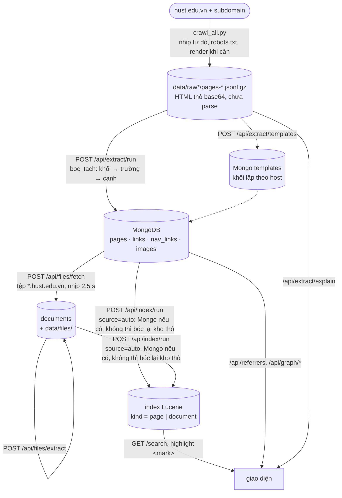

# HUST Crawl & Search

Crawl `hust.edu.vn` và các subdomain, index bằng **Apache Lucene thuần**, tìm
kiếm qua giao diện web. Đóng gói bằng docker compose.

Tài liệu này viết để **người hoặc AI khác đọc rồi sửa được ngay**: mỗi phần đều
nói rõ file nào làm gì, vì sao chọn cách đó, và chỗ nào từng hỏng.

Tài liệu liên quan:

| File | Nội dung |
|---|---|
| `../BAO-CAO-KY-THUAT.md` | báo cáo kỹ thuật: **sơ đồ** luồng dữ liệu và từng thuật toán (crawl, chọn khối, khử khuôn, đồ thị, tệp, tìm kiếm) |
| `SCHEMA.md` | lược đồ MongoDB, sơ đồ quan hệ, trạng thái tệp |
| `KE-HOACH-BOC-TACH.md` | kế hoạch bóc tách, các quyết định đã chốt, tiến độ |
| `../hust-crawler/README.md` | crawler: cách chạy, số liệu kho, những lỗi đã gặp |

---

## 1. Chạy trong 3 lệnh

```bash
cd hust-search
docker compose up -d --build          # lần đầu ~5 phút (build maven + playwright)
open http://localhost:8000            # giao diện
```

Kiểm tra sống:

```bash
curl -s localhost:8000/api/health     # {"api":true,"lucene":true,...}
./tests/integration.sh                # 33 kiểm tra đường đi thật
```

Lần đầu Mongo và index đều rỗng. Vào tab **Bảng điều khiển**, chạy lần lượt bốn ô
ở thẻ "Bóc tách và tệp" (dựng khuôn → bóc tách → tải tệp → bóc chữ), rồi bấm
**Index thêm vào kho**. Hoặc bằng lệnh:

```bash
curl -X POST localhost:8000/api/extract/templates     # chạy nền; xem /api/extract/status
curl -X POST localhost:8000/api/extract/run           # đợi xong bước trước rồi mới gọi
curl -X POST localhost:8000/api/index/run -H 'content-type: application/json' -d '{"batch":200}'
```

Bỏ qua bước bóc tách cũng được: `index/run` với `source=auto` thấy Mongo rỗng thì
tự bóc thẳng từ kho thô — chỉ là không có đồ thị liên kết và tệp.

Dừng: `docker compose down` (index nằm ở volume `lucene-index`, không mất).

---

## 2. Cây thư mục

```
DI/
├── hust-crawler/                  ENGINE CRAWL — chạy được độc lập, không cần docker
│   ├── crawl_all.py               bò toàn site, lưu HTML thô base64 vào JSONL
│   ├── read_raw.py                đọc/soát kho: stats, audit, links, rebuild-state…
│   ├── render.py                  tải bằng Chromium thật khi requests lấy hụt
│   ├── crawl_hust.py              wrapper có parse (bóc bài ra 17 trường) — độc lập
│   ├── hustctl                    lệnh gọn: start / stop / status / resume / file
│   ├── crawl_subdomains.sh        quét lần lượt nhiều subdomain
│   ├── tests/test_engine.py       32 test cho engine
│   └── data/                      KHO DỮ LIỆU (gitignored)
│       ├── raw/                   kho của hust.edu.vn
│       │   ├── pages-*.jsonl.gz   mỗi dòng một trang, HTML ở trường html_b64
│       │   ├── state.json         hàng đợi + đã tải + bảng khoá bài
│       │   ├── N1-links           danh sách link, mỗi dòng một link, KHÔNG có đuôi
│       │   ├── subdomains.txt     58 host thuộc hust.edu.vn
│       │   └── sample20.txt, sample10hard.txt
│       └── raw-<host>/            mỗi subdomain một kho riêng, cùng cấu trúc
│
└── hust-search/                   STACK DOCKER
    ├── docker-compose.yml         3 dịch vụ: lucene (Java) + api (Python) + mongo
    ├── SCHEMA.md                  lược đồ MongoDB (pages, links, nav_links, images, documents, templates)
    ├── KE-HOACH-BOC-TACH.md       kế hoạch bóc tách / đồ thị / Mongo và các quyết định đã chốt
    ├── THUAT-TOAN-BOC-TACH.md     giải thích thuật toán chọn khối, khử khuôn, bóc trường, đồ thị (có sơ đồ Mermaid)
    ├── lucene/                    DỊCH VỤ TÌM KIẾM — Java 21 + Lucene 9.11
    │   ├── pom.xml
    │   ├── Dockerfile             build đa tầng: maven → JRE
    │   └── src/
    │       ├── main/java/vn/hust/search/
    │       │   ├── Index.java         bọc Lucene: put/commit/search/stats/reset, xếp hạng, highlight
    │       │   ├── Fold.java          bỏ dấu tiếng Việt (analyzer cho title_kd/text_kd)
    │       │   ├── Rank.java          điểm nền cho ranking=enhanced
    │       │   ├── Sig.java           SimHash 64-bit để gộp bản trùng
    │       │   └── SearchServer.java  HTTP bằng com.sun.net.httpserver của JDK
    │       └── test/java/.../IndexTest.java   30 test
    ├── api/                       ĐIỀU KHIỂN + GIAO DIỆN — Python FastAPI
    │   ├── main.py                crawl start/stop/status, index, search, stats, fetch; extract() = boc_tach()
    │   ├── boc_tach/              __init__.py: boc_tach() và giai_thich() (vết thuật toán cho giao diện)
    │   │                          khoi.py (khối nội dung) · khuon.py (khử khuôn theo host)
    │   │                          truong.py (tiêu đề/ngày/tác giả/nguồn) · lien_ket.py (đồ thị)
    │   │                          tep.py (bóc chữ pdf/docx/xlsx/pptx) · html_sach.py
    │   ├── db.py                  kết nối Mongo + $jsonSchema + index
    │   ├── trich.py               kho thô → boc_tach → Mongo; index từ Mongo
    │   ├── tep_job.py             danh mục / tải / bóc chữ tệp tài liệu
    │   ├── routes_bt.py           /api/extract/* (cả explain, overview), /api/referrers, /api/graph/*,
    │   │                          /api/files, /api/images
    │   ├── static/index.html      giao diện một trang, không framework
    │   ├── requirements.txt
    │   └── Dockerfile             nền image playwright (có sẵn Chromium)
    ├── tests/fixtures/corpus.json corpus mẫu theo schema public
    ├── tests/fixtures/html/       trang mẫu TỔNG HỢP 6 kiểu bố cục, kèm nhãn vàng
    ├── tests/test_api.py          5 test parser/schema
    ├── tests/test_boc_tach.py     25 test: khối nội dung, vết thuật toán, khuôn, trường, đồ thị
    ├── tests/test_mongo.py        21 test: Mongo bằng mongomock (không thực thi $jsonSchema), route
    ├── tests/test_tep.py          13 test: bóc chữ tệp, tải bằng httpx.MockTransport
    ├── tests/sinh_mau.py          sinh trang mẫu TỔNG HỢP; danh_gia_khoi.py đo P/R/F1
    ├── tests/integration.sh       kiểm tra trên stack đang chạy (đường tìm kiếm)
    └── tests/integration_bt.sh    kiểm tra bóc tách + đồ thị + Mongo trên stack đang chạy
```

**Chia việc giữa hai ngôn ngữ:** Python bóc chữ từ HTML (BeautifulSoup và bộ
selector cho hust.edu.vn đã kiểm chứng ở tầng crawl), Java chỉ lo đúng việc của
Lucene là index và tìm. Nhờ vậy phía Java không cần jsoup, không cần biết gì về
cấu trúc site.

---

## 3. Luồng dữ liệu



Sơ đồ chi tiết của từng thuật toán (chọn khối, khử khuôn, chia cạnh, trạng thái
tệp, một lượt tìm kiếm) ở `../BAO-CAO-KY-THUAT.md`.

Ba tầng tách rời có chủ đích: **tải là phần đắt và bị rate-limit, parse thì rẻ
và hay phải sửa**. Có kho thô rồi thì sửa selector hay index lại bao nhiêu lần
cũng không phải đụng lại mạng.

---

## 4. Dùng crawler

### 4.1. Lệnh gọn — `hustctl`

```bash
cd hust-crawler
./hustctl status                     # đang chạy gì, mỗi site tải/chờ bao nhiêu
./hustctl resume                     # chạy tiếp mẻ dở
./hustctl links-only                 # chỉ lấy link, không tải nội dung bài
./hustctl file data/sample20.txt     # crawl đúng danh sách link trong file
./hustctl log 40                     # 40 dòng log cuối
./hustctl stop                       # dừng mềm: đóng shard, ghi state rồi thoát
./hustctl kill                       # chỉ khi stop không ăn
```

`hustctl` ghi pid ra `data/crawler.pid` nên dừng đúng tiến trình.
**Đừng `pkill -f crawl_all.py`** — nó khớp cả dòng lệnh shell đang gõ và giết
nhầm terminal.

### 4.2. Crawl theo file danh sách link

```bash
python crawl_all.py --resume --from-file data/sample20.txt --allow-domain hust.edu.vn
```

| Tham số | Ý nghĩa |
|---|---|
| `--from-file F` | crawl đúng các url trong F (bỏ dòng trống và dòng `#`) |
| `--follow` | bò tiếp theo link tìm được; mặc định chỉ tải đúng danh sách |
| `--allow-domain D` | nhận mọi host thuộc D, cần khi file trộn nhiều subdomain |

**Luôn kèm `--resume`** khi kho đã có dữ liệu. Xem mục 8.4 vì sao.

### 4.3. Trang khó — render bằng trình duyệt thật

```bash
python crawl_all.py --resume --from-file data/sample10hard.txt \
   --allow-domain hust.edu.vn --render auto --insecure
```

| Tham số | Ý nghĩa |
|---|---|
| `--render never` | mặc định, chỉ dùng requests |
| `--render auto` | chỉ render khi trang **có vẻ bị chặn hoặc rỗng do JS** |
| `--render always` | render mọi trang, chậm hơn nhiều |
| `--insecure` | bỏ kiểm chứng chỉ TLS (vài subdomain thiếu chứng chỉ trung gian) |

`render.py` quyết định "có vẻ bị chặn" bằng `looks_blocked()`: status 403/429/503,
hoặc HTML chứa dấu hiệu chặn bot, hoặc trang gần như không có link và rất ít chữ.

Đây là công cụ đọc trang công khai mà JavaScript mới dựng ra. Gặp captcha thật
thì trả về nguyên trạng để ghi nhận là bị chặn, không tìm cách giải.

### 4.4. Site khác / subdomain

```bash
python crawl_all.py --site svbk.hust.edu.vn --only listing
./crawl_subdomains.sh bulletin tuyendung work        # quét lần lượt
```

Mỗi site một kho riêng `data/raw-<host>/`. Kiểu phân trang tự nhận theo 6 mẫu
(`/page-N/`, `/page/N/`, `?page=N`, `?paged=N`, `/trang-N/`, `/pN/`) và crawler
dùng **đúng khuôn url mà chính trang đó in ra** nên CMS khác không phải sửa code.

### 4.5. Soát kho

```bash
python read_raw.py --stats           # kho có gì
python read_raw.py --audit           # chuyên mục nào tải thiếu trang
python read_raw.py --fix-roots       # chuyên mục nào rơi khỏi hàng đợi
python read_raw.py --check           # state và shard có lệch nhau không
python read_raw.py --links           # xuất lại N1-links (gộp mọi kho + subdomain)
python read_raw.py --verify-links    # soát độc lập: bóc lại href từ HTML mà đối chiếu
python read_raw.py --rebuild-state   # CỨU HỘ: dựng lại state.json từ shard + N1-links
```

Bốn lệnh đầu trả lời bốn câu hỏi khác nhau, đừng nhầm — xem mục 8.

---

## 5. API

Tất cả dưới `http://localhost:8000`.

| Method | Đường dẫn | Việc |
|---|---|---|
| GET | `/` | giao diện |
| GET | `/api/health` | api và lucene có sống không |
| GET | `/api/stats` | mỗi site tải/chờ bao nhiêu, dung lượng, số link |
| POST | `/api/crawl/start` | chạy một mẻ crawl |
| POST | `/api/crawl/stop` | SIGTERM rồi chờ 30s, cùng lắm mới kill |
| GET | `/api/crawl/status` | đang chạy không, log 12 dòng cuối |
| POST | `/api/index/run` | `source=auto\|mongo\|raw`: Mongo (hoặc kho thô) → Lucene |
| POST | `/api/extract/templates` | dựng bảng khối lặp theo host (chạy nền) |
| POST | `/api/extract/run?limit=` | kho thô → boc_tach → Mongo (chạy nền, idempotent) |
| GET | `/api/extract/status`, `/api/extract/coverage` | tiến độ; % trường đầy đủ và cách chọn khối theo host |
| GET | `/api/extract/explain?url=` | chạy lại bước chọn khối trên HTML thô trong kho, trả từng bước để vẽ (không cần Mongo) |
| POST | `/api/extract/url` | **url bất kỳ** `{url, tai_lai, luu, index}`: lấy HTML trong kho, chưa có thì tải từ web (nhịp ≥ 3 s), chọn khối + bóc trường + chia cạnh, ghi Mongo (`pages`, `links`, ảnh, danh mục tệp) và Lucene; trả kèm từng bước để vẽ. Url là pdf/docx/xlsx/pptx thì bóc chữ vào `documents` |
| GET | `/api/extract/overview` | số liệu từng bước khuôn → bóc tách → tệp → bóc chữ |
| GET | `/api/referrers?url=` | nguồn giới thiệu: cạnh trong bài + cạnh menu/footer trỏ vào url |
| GET | `/api/graph/out?url=`, `/api/graph/stats`, `/api/graph/edges.csv` | cạnh đi ra; thống kê; xuất `source,target,text` |
| POST | `/api/files/fetch`, `/api/files/extract` | tải tệp (409 khi crawler đang chạy) và bóc chữ |
| GET | `/api/files`, `/api/images` | danh mục tệp / ảnh kèm số trang giới thiệu |
| POST | `/api/index/documents` | nhận corpus JSON theo schema public |
| GET | `/api/index/stats` | số tài liệu, dung lượng index, theo host |
| GET | `/api/search?q=&size=&host=&kind=&ranking=` | kết quả kèm đoạn đã tô `<mark>` |
| POST | `/api/fetch` | tải một URL, trả document và index ngay |

```bash
# crawl tiếp, trần 200 trang
curl -X POST localhost:8000/api/crawl/start -H 'content-type: application/json' \
     -d '{"mode":"resume","max_pages":200}'

# chỉ lấy link của một subdomain
curl -X POST localhost:8000/api/crawl/start -H 'content-type: application/json' \
     -d '{"mode":"listing","site":"svbk.hust.edu.vn","max_pages":300}'

# tải một bài, bóc document và index ngay
curl -X POST localhost:8000/api/fetch \
     -H 'content-type: application/json' \
     -d '{"url":"https://hust.edu.vn/vi/news/example.html"}'

# index một corpus JSON (reset=true nếu muốn dựng lại từ đầu)
curl -X POST localhost:8000/api/index/documents \
     -H 'content-type: application/json' --data @tests/fixtures/corpus.json

# tìm theo TF-IDF của Lucene
curl -s --get localhost:8000/api/search \
     --data-urlencode "q=diem chuan" --data-urlencode "ranking=tfidf" \
     --data-urlencode "sort=score"
```

### Schema tài liệu public

`/api/fetch` trả `document`, và `/api/index/documents` nhận cùng một cấu trúc:

```json
{
  "url": "https://hust.edu.vn/vi/news/example.html",
  "title": "Tiêu đề bài viết",
  "content": "Nội dung văn bản đã bóc tách",
  "host": "hust.edu.vn",
  "section": "Tin tức",
  "published_at": "2026-09-11",
  "outgoing_links": [
    {"url": "https://hust.edu.vn/admissions/", "text": "Thông tin tuyển sinh"}
  ]
}
```

`url` và `outgoing_links[].url` chỉ nhận HTTP/HTTPS; request corpus tối đa 5.000
tài liệu. `title` tối đa 500 ký tự, `content` tối đa 200.000 ký tự,
`published_at` rỗng hoặc dạng `YYYY-MM-DD`. `host` rỗng sẽ được suy từ hostname;
URL trùng trong một request giữ bản cuối. Các link đi ra được chuẩn hóa bằng
`urljoin`, bỏ fragment, lọc scheme nguy hiểm và khử trùng. Mảng link chỉ phục vụ
output/hiển thị, chưa đưa vào chỉ mục Lucene.

### Xếp hạng

`ranking=tfidf` là mặc định: Lucene dùng `ClassicSimilarity`, tìm trên
`title_kd` và `text_kd` với boost bằng nhau. Điểm dùng ý tưởng
`TF × IDF × document norm`; query không dấu vẫn tìm được nội dung có dấu.
`ranking=enhanced` giữ các thưởng cụm, loại trang, độ dài và độ mới hiện có.

`sort=score` mới là thứ tự theo điểm; khi đó UI gọi đúng tên điểm theo chế độ.
`sort=date` sắp ngày mới trước và không gọi số điểm đó là TF-IDF.

Lucene cũng nghe trực tiếp ở `localhost:8081` (`/bulk`, `/search`, `/list`, `/dict`,
`/posting`, `/doc`, `/stats`, `/reset`, `/health`) — tiện khi cần gỡ lỗi riêng tầng index.

---

## 6. Giao diện

Một file `api/static/index.html`, không framework, không bước build.

* **Tìm kiếm** — gõ từ khoá, lọc theo site và chọn `TF-IDF` hoặc `Nâng cao`.
  Phần khớp được **Lucene** tô `<mark>` (màu bơ pastel), bấm tiêu đề mở trang
  gốc ở tab mới; khi xếp theo điểm, giao diện ghi rõ điểm TF-IDF.
* **Tải một trang** — trả tiêu đề, nội dung, URL đầy đủ và văn bản mô tả của
  link đi ra; nội dung thu gọn mặc định và có nút tải JSON.
* **Duyệt tất cả** — liệt kê toàn bộ index, sắp theo ngày/url, lọc theo site.
* **Chỉ mục ngược** — duyệt từ điển term của Lucene và danh sách posting của một term.
* **Bóc tách khối** — nhập url một trang trong kho, vẽ lại ba bước: phễu số chữ
  còn lại qua từng lớp (dọn cây → khử khuôn → khối chọn), các bậc đi xuống cây HTML
  (thanh điểm của từng khối con, vạch ngưỡng 65%), và thanh chia liên kết trong khối
  (cạnh nội dung) / ngoài khối (cạnh khuôn). Mỗi kết quả tìm kiếm có nút "Khối nội dung".
* **Đồ thị liên kết** — đồ thị hình sao bằng SVG tự vẽ: trái là trang trỏ tới, giữa là
  url đang xem, phải là nơi nó trỏ đi; màu theo loại (trang / tệp / ảnh / ngoài HUST /
  menu-footer nét đứt). Bấm một ô để chuyển tâm. Dạng bảng cũ vẫn còn trong "Xem dạng bảng".
* **Tệp & ảnh** — danh sách tệp (trạng thái, cờ `needs_ocr`) và ảnh, mỗi dòng có số trang
  giới thiệu và nút mở đồ thị.
* **Bảng điều khiển** — số trang crawl, số tài liệu index, số link, dung lượng;
  bảng từng site; nút chạy/dừng crawl; nút index thêm hoặc dựng lại; log trực tiếp;
  bốn bước bóc tách vẽ thành dải ô nối mũi tên, mỗi ô ghi số liệu đã có và sáng lên khi đang chạy.

Tô sáng làm ở **server chứ không phải trình duyệt**: Lucene biết chính xác token
nào khớp sau khi phân tích, còn JS phía trình duyệt chỉ so chuỗi thô nên sẽ trượt
các trường hợp hoa/thường hay dấu câu dính liền.

Màu: nền giấy ấm `#fbf9f6`, chấm phá mint / blush / sky / lilac pastel, chữ
**Be Vietnam Pro** cho tiếng Việt và **Lora** cho tiêu đề.

### Kịch bản demo 5–7 phút

1. Mở tab **Tải một trang**, dán URL bài viết, bấm **Tải và index**; chỉ ra tiêu
   đề, nội dung thu gọn và bảng URL/link mô tả, rồi bấm **Tải JSON** nếu cần.
2. Nạp corpus cố định:

   ```bash
   curl -X POST localhost:8000/api/index/documents \
        -H 'content-type: application/json' --data @tests/fixtures/corpus.json
   ```

3. Tìm không dấu theo TF-IDF:

   ```bash
   curl -s --get localhost:8000/api/search \
        --data-urlencode 'q=tuyen sinh ky thuat' \
        --data-urlencode 'ranking=tfidf' --data-urlencode 'sort=score'
   ```

   Chỉ ra `ranking`, điểm giảm dần, đoạn `<mark>` và lựa chọn ranking trong UI.
4. Bấm nút **Khối nội dung** trên một kết quả: tab **Bóc tách khối** cho thấy thuật
   toán đã bỏ bao nhiêu chữ qua từng lớp và đi xuống cây HTML thế nào.
5. Bấm **Xem đồ thị quanh trang này**: tab **Đồ thị liên kết** hiện ai trỏ tới trang
   và trang trỏ đi đâu; bấm một tệp PDF để xem nguồn giới thiệu của nó.

---

## Hướng dẫn chạy theo yêu cầu đề bài

### A. Khởi động

```bash
cd hust-search
docker compose up -d --build
curl -s http://localhost:8000/api/health
open http://localhost:8000
```

Chỉ tiếp tục khi response health có `"api":true` và `"lucene":true`. Index
nằm trong volume Docker `lucene-index`; `docker compose down` không xóa volume.

### B. Luồng thu thập dữ liệu

Trên giao diện: chọn **Tải một trang** → dán URL bài viết đầy đủ
(`http://` hoặc `https://`) → bấm **Tải và index**. Kết quả phải có tiêu đề,
nội dung, số link đi ra, URL đầy đủ và văn bản mô tả. Nút **Tải JSON** lưu đúng
`document` theo schema public.

Có thể chạy bằng lệnh:

```bash
curl -s -X POST http://localhost:8000/api/fetch \
  -H 'content-type: application/json' \
  -d '{"url":"https://THAY-BANG-URL-BAI-VIET-THAT"}' | python3 -m json.tool
```

Trong response, kiểm tra các trường:

```text
response.document.title
response.document.content
response.document.outgoing_links[].url
response.document.outgoing_links[].text
```

Trang tải lẻ được ghi vào `hust-crawler/data/raw-adhoc/` và index ngay. Máy chủ
giữ khoảng cách tối thiểu 3 giây giữa hai lần tải; HTTP 429 nghĩa là website
đang giới hạn nhịp.

### C. Luồng JSON → chỉ mục → truy vấn

Dùng corpus cố định để trình diễn không phụ thuộc website:

```bash
curl -s -X POST http://localhost:8000/api/index/documents \
  -H 'content-type: application/json' \
  --data @tests/fixtures/corpus.json | python3 -m json.tool
```

Sau đó tìm theo TF-IDF:

```bash
curl -s --get http://localhost:8000/api/search \
  --data-urlencode 'q=fixturealpha' \
  --data-urlencode 'ranking=tfidf' \
  --data-urlencode 'sort=score' \
  --data-urlencode 'size=10' | python3 -m json.tool
```

Response cần có `ranking: "tfidf"`, `sort: "score"`, danh sách `hits`,
`score` và `fragments` chứa `<mark>`. Dùng `q=diem chuan` để chứng minh truy
vấn không dấu vẫn tìm được nội dung có dấu. Luôn dùng `sort=score` khi cần
khẳng định thứ tự TF-IDF; `sort=date` chỉ sắp theo ngày.

Trên giao diện, chọn tab **Tìm kiếm**, chọn **TF-IDF**, nhập cùng truy vấn và
giữ **Xếp theo độ khớp**. Chọn **Nâng cao** chỉ khi muốn trình diễn chế độ
`ranking=enhanced`, không gọi đó là TF-IDF thuần.

### D. Index lại kho crawler

```bash
# thêm tài liệu mới vào index
curl -X POST http://localhost:8000/api/index/run \
  -H 'content-type: application/json' -d '{"reset":false,"batch":200}'

# xóa index rồi dựng lại từ toàn bộ kho raw
curl -X POST http://localhost:8000/api/index/run \
  -H 'content-type: application/json' -d '{"reset":true,"batch":150}'
```

`reset=true` chỉ được dùng khi chủ động dựng lại; không dùng
`docker compose down -v` nếu muốn giữ volume index.

### E. Kiểm tra trước khi trình diễn

```bash
./tests/integration.sh
cd lucene && docker run --rm -v "$PWD":/w -v hust-m2:/root/.m2 \
  -w /w maven:3.9-eclipse-temurin-21 mvn -B test
```

Kết quả lần chạy gần nhất có ghi lại: 33 integration, 30 JUnit, 64 pytest phía
api và 32 test crawler. Riêng 64 pytest phía api đã chạy lại sau thay đổi giao diện
trực quan; các bộ còn lại chưa chạy lại kể từ đó (không đụng code Java/crawler).

---

## 7. Test

```bash
# engine (32 test)
cd hust-crawler && .venv/bin/python -m pytest tests -q

# Python phía api (81 test: parser, boc_tach, Mongo bằng mongomock, tệp; không gọi mạng thật)
cd hust-search && docker run --rm -v "$PWD":/workspace -v "$PWD/../hust-crawler":/crawler \
    -w /workspace hust-search-api:latest python -m pytest tests -q

# đo thuật toán khối nội dung (trên trang TỔNG HỢP — xem tests/sinh_mau.py)
python tests/danh_gia_khoi.py

# Lucene (30 test)
cd hust-search/lucene && docker run --rm -v "$PWD":/w -v hust-m2:/root/.m2 \
    -w /w maven:3.9-eclipse-temurin-21 mvn -B test

# tích hợp (cần stack đang chạy)
cd hust-search && ./tests/integration.sh        # đường tìm kiếm
cd hust-search && ./tests/integration_bt.sh     # bóc tách, đồ thị, Mongo (chờ job nền, WAIT=900 giây)
```

Trạng thái đã chạy được trong môi trường viết code (không có docker, không có kho thật):
**64 pytest phía api + 30 JUnit = đạt**; `integration_bt.sh` chạy được 17/17 trên Lucene thật + API
với mongomock + corpus tổng hợp. **Chưa chạy** trên stack docker đầy đủ với MongoDB thật và kho thật —
nên chưa kiểm chứng `$jsonSchema`, hiệu năng, và độ chính xác thuật toán khối trên trang thật.

Mỗi test ứng với một lỗi đã gặp thật, tên test nói rõ lỗi đó — sửa code mà làm
đỏ test nào thì đọc tên test là biết mình vừa phá cái gì.

### Sample chạy thật

| Mẫu | File | Kết quả |
|---|---|---|
| 20 link mục còn thiếu | `data/sample20.txt` | **20/20 tải được**, 7 MB, 0,8 phút |
| 10 link khó | `data/sample10hard.txt` | **10/10 render được** bằng Chromium |

10 link khó gồm: SPA (`work`), TLS thiếu chứng chỉ trung gian (`tuyendung`),
site đã tắt (`bulletin`), cổng đăng nhập (`ctt-sis`), phân trang `?page=`
(`library`), và 5 subdomain khác. Với `requests` thuần thì `work` chỉ ra 6 KB
khung rỗng và `tuyendung` hỏng hẳn; qua trình duyệt thì lần lượt 35 KB và 58 KB.

---

## 7b. So sánh bóc cũ với bóc mới (đo xem bóc tách có làm tìm kiếm tốt hơn không)

`api/so_sanh.py` dựng **hai instance Lucene riêng** (không đụng index chính) từ cùng một kho thô:
arm *cũ* = hành vi `extract()` trước `boc_tach` (`.bodytext` → `main` → `body`), arm *mới* = `boc_tach`
(có khử khuôn theo host; tắt bằng `--no-khuon`). Sau đó chạy cùng một bộ truy vấn trên cả hai.

```bash
cd hust-search
docker compose --profile compare up -d --build lucene-cu lucene-moi
# bước 1: không cần nhãn. --reset chỉ cần nếu hai instance đã có dữ liệu từ lần chạy trước
docker compose exec api python so_sanh.py --queries /app/truyvan.txt   # bỏ --queries để dùng bộ đoán sẵn
# kết quả ở hust-crawler/data/so_sanh/: report.md, phan_loai.csv, raw.json

# bước 2: mở phan_loai.csv, điền cột relevant = 1/0 cho từng dòng, rồi
docker compose exec api python so_sanh.py --evaluate /crawler/data/so_sanh/phan_loai.csv
# → danh_gia.md: P@K và MRR của từng arm
```

* **Bước 1 chỉ mô tả sự khác biệt, không phán bên nào tốt hơn:** quy mô index, từ có mặt ở gần mọi trang
  (dấu hiệu rác khuôn), trang nghi bị cắt quá tay, độ trùng top-K theo từng truy vấn, trang "mất/thêm" kèm
  đoạn trích. Cột `mất` có thể là khớp nhờ menu (loại đúng) hoặc nội dung bị cắt (loại sai) — phải đọc ví dụ.
* **Chỉ bước 2 mới cho kết luận**, và chỉ đáng tin khi bộ truy vấn là truy vấn người dùng thật và nhãn do
  người đọc gán. Nhãn lấy từ top-K của hai arm nên không đo được recall.
* Bộ truy vấn mặc định trong code là **đoán** về chủ đề hay gặp, chưa kiểm với kho thật; vài từ cuối
  ("liên hệ", "giới thiệu", "tin tức") cố ý là từ hay nằm ở menu để dò nhiễu. Nên thay bằng `--queries`.
* Cột `tổng` là số Lucene trả về, có thể gồm lượt "vét" khớp một phần; xem ghi chú trong báo cáo.
* Nên chạy thử `--limit 300` trước để thấy báo cáo, rồi mới chạy cả kho. Xong thì
  `docker compose --profile compare down` (thêm `-v` nếu muốn xoá hai volume index so sánh).

Đã kiểm trên corpus tổng hợp (Lucene thật, 150 trang): chạy hết cả hai bước, báo cáo và file nhãn sinh đúng.
Chưa chạy trên kho thật.

---

## 8. Những chỗ từng hỏng — đọc trước khi sửa

### 8.1. Site chặn ~20-25 request/phút

Đặt nhịp 2,2 req/s thì crawler chạy được 0,55 trang/s. `sample <pid>` cho thấy
cả 5 luồng nằm 100% trong `time.sleep`: server trả 429 kèm `Retry-After: 30`,
mà code cũ cho **mỗi luồng ngủ riêng** rồi lại ùa vào.

Nay nhịp **tự dò**: dính 429 thì nhân 1,5 và **cả đàn cùng nghỉ**; yên 25 request
thì rút 10%. `--delay` mặc định 2,5s, **đừng hạ dưới 2**. Thêm luồng không nhanh
hơn vì nhịp khoá chung.

### 8.2. Shard gzip phải flush từng dòng

Flush thưa 25 dòng thì kill cứng làm mất dữ liệu đã ghi. Đo bằng script tự
`kill -9`: flush từng dòng cứu được **301/301** dòng, flush thưa 300, không flush 0.

### 8.3. Khoá khử trùng là ĐOẠN CUỐI url, không phải con số cuối

Ba bài khác hẳn nhau cùng mang đuôi `-654601.html`. Dùng con số làm khoá thì mất
159 bài. Dùng `dedup_key()`, đừng dùng `art_id()` làm khoá.

### 8.4. `--from-file` mà quên `--resume` sẽ xoá sạch state

State chỉ được nạp khi có `--resume`, nên chạy `--from-file` trần thì state khởi
tạo rỗng rồi `save_state()` cuối mẻ ghi đè lên file — mất luôn hàng đợi 4.220 url.

Đã sửa: **luôn nạp state nếu file có**, `--resume` giờ chỉ quyết định có gieo lại
hạt giống hay không. Lỡ mất thì `read_raw.py --rebuild-state` dựng lại từ shard
và `N1-links`.

### 8.5. Lucene 9 là multi-release JAR, đừng shade

Gói phẳng bằng maven-shade làm mất `META-INF/versions/19/` và mất
`MemorySegmentIndexInputProvider`; chạy trên Java 21 ném `LinkageError` ngay khi
mở index. `pom.xml` dùng jar mỏng + thư mục `lib/`, giữ nguyên jar gốc của Lucene.

### 8.6. Highlighter cần MỘT QueryScorer dùng chung

Tạo hai cái riêng cho `Highlighter` và `SimpleSpanFragmenter` thì cái của
fragmenter không bao giờ được init và `getBestFragments` ném NullPointerException.

### 8.7. Playwright sync API gắn với luồng tạo ra nó

Dùng chung một browser giữa các luồng thì ném *"cannot switch to a different
thread"*. `render.py` cho **mỗi luồng một browser** qua `threading.local()`.
Ngoài ra `networkidle` hay timeout với trang có long-poll, nên có bước lùi về
`domcontentloaded`.

### 8.8. Chuyên mục có thể biến mất khỏi kế hoạch crawl

Từng mất 111 chuyên mục (gồm `tin-tuc-su-kien` 295 trang và cả phần tiếng Anh).
Sau mỗi mẻ dài chạy `--fix-roots` rồi `--audit`.

### 8.9. Danh sách link chỉ lấy `href`, không lấy `src`

Gộp `src` vào thì ảnh nhúng `/uploads/` làm file phình từ 14k lên 24k dòng mà
không thêm link nào đi tới được.

---

## 9. Muốn sửa thì sửa ở đâu

| Muốn | Sửa file | Chỗ nào |
|---|---|---|
| Thêm kiểu phân trang mới | `crawl_all.py` | `PAGE_PATTERNS` |
| Đổi luật bỏ qua url | `crawl_all.py` | `SKIP_SEG`, `SKIP_QUERY`, `ASSET` |
| Đổi cách nhận diện bài viết | `crawl_all.py` | `ART_ID`, `dedup_key()`, `kind_of()` |
| Đổi ngưỡng "trang cần render" | `render.py` | `looks_blocked()` |
| Đổi cách chọn khối nội dung | `api/boc_tach/khoi.py` | `ALPHA/BETA/GAMMA/DELTA`, `SELECTOR_THEO_HOST`, `tim_khoi()` |
| Đổi ngưỡng khử khuôn | `api/boc_tach/khuon.py` | `NGUONG_TRANG`, `TOI_THIEU_TRANG` |
| Đổi cách bóc tiêu đề/ngày/tác giả | `api/boc_tach/truong.py` | các hàm `tieu_de`, `ngay_dang`, `tac_gia_meta` |
| Đổi luật cạnh nội dung / cạnh khuôn | `api/boc_tach/lien_ket.py` | `chia()`, `loai_dich()` |
| Đổi lược đồ Mongo | `api/db.py` + `SCHEMA.md` | `SCHEMAS` |
| Đổi trọng số xếp hạng | `Index.java` | `MultiFieldQueryParser`, map boost |
| Đổi cách tô sáng | `Index.java` | `SimpleHTMLFormatter("<mark>", "</mark>")` |
| Đổi màu, bố cục | `api/static/index.html` | khối `:root` ở đầu `<style>` |
| Đổi giao diện trực quan bóc tách / đồ thị | `api/static/index.html` | `veKhoi()`, `veBac()`, `veDoThiSao()`, `veDayChuyen()` |
| Đổi dữ liệu vết thuật toán | `api/boc_tach/__init__.py`, `khoi.py` | `giai_thich()`, `_ghi_bac()` |
| Thêm endpoint | `api/main.py` (crawl/index/tìm) hoặc `api/routes_bt.py` (bóc tách/đồ thị/tệp) | thêm route FastAPI |

Thay đổi `ClassicSimilarity` hoặc schema field thì phải dựng lại image và index:

```bash
docker compose build lucene && docker compose up -d
curl -X POST localhost:8000/api/index/run \
     -H 'content-type: application/json' -d '{"reset":true,"batch":150}'
```

Sửa Java thì `docker compose build lucene && docker compose up -d`.
Sửa Python phía api hoặc giao diện thì không cần build lại vì `./api` đã mount vào
`/app`: giao diện tải lại trang là thấy, code Python thì `docker compose restart api`.
Thêm thư viện vào `requirements.txt` thì mới phải `docker compose build api`.
Sửa `crawl_all.py` không cần build lại: thư mục `hust-crawler` được mount vào
container ở `/crawler`.

---

## 10. Giới hạn đã biết

* **Chưa tải nội dung hết**: lần rebuild baseline có 3.406 tài liệu index trên ~5.600 bài đã phát hiện.
  Chạy tiếp bằng `./hustctl resume` (~3 giờ ở nhịp 24 trang/phút).
* **Subdomain**: mới crawl link bên trong 2/51 host (`library`, `svbk`); theo số liệu
  ghi lần trước, 11/51 host có trang trong kho nhưng phần lớn chỉ là trang chủ; còn lại chỉ
  có link "cửa vào" từ trang chính.
* **Tệp đính kèm**: chỉ tải host `*.hust.edu.vn` (host ngoài như Google Drive chỉ có cạnh trong đồ thị);
  không OCR — PDF scan gắn `needs_ocr`; doc/xls/ppt cũ là `unsupported`.
* **Thuật toán khối nội dung chưa được đo trên trang thật**: bộ đánh giá hiện là trang tổng hợp,
  các hằng số ở `khoi.py` là khởi điểm chưa dò. Xem `/api/extract/coverage` sau khi bóc tách kho thật,
  và soi từng trang ở tab **Bóc tách khối**.
* **`/api/extract/url` với trang lẻ không ghi `nav_links`** (bảng đó đếm số trang theo host, ghi lẻ rồi
  ghi lại sẽ đếm đôi). Trang lẻ nằm trong `raw-adhoc` nên lần "Bóc tách kho → Mongo" sau sẽ gom đủ.
  Trang ở host ngoài họ hust.edu.vn: mọi liên kết của nó là `external`, nên tệp/ảnh của site đó không vào
  danh mục (theo quyết định "không tải tệp host ngoài"). Url lưu qua `norm()` nên luôn hiện `https://`,
  kể cả site chỉ có http; khi tải thì dùng url gốc và tự thử lại `http://` nếu `https://` lỗi kết nối.
  Route này tải url bất kỳ từ máy chủ — chỉ chạy stack ở máy cá nhân/mạng nội bộ (stack không có xác thực).
* **`/api/extract/explain` quét kho thô** để tìm HTML của url (lọc thô bằng chuỗi trước khi giải mã);
  chưa đo tốc độ trên kho ~200 MB. Giao diện trực quan mới thử trên dữ liệu giả.
* **`nav_links` có thể phình** vì gồm cả liên kết ngoài khối nội dung nhưng riêng cho từng trang
  (vd. "tin liên quan"); chưa đo số dòng trên kho thật.
* **Phân tích tiếng Việt ở mức âm tiết**: `StandardAnalyzer` tách theo chuẩn
  Unicode nên "điểm chuẩn" thành hai token. Tìm cụm vẫn đúng, nhưng chưa có tách
  từ ghép. Muốn tốt hơn thì cắm một `Analyzer` tiếng Việt vào `Index.java`.
* **Không có xác thực**: stack mở cổng 8000/8081 không mật khẩu, chỉ dùng ở máy
  cá nhân hoặc mạng nội bộ.

---

## 11. Ghi chú về việc thu thập

Dữ liệu là thông tin công khai trên cổng thông tin của trường, dùng cho bài tập
môn học. `User-Agent` để nguyên dạng có thông tin liên hệ:

```
hust-research-crawler/1.0 (nghien cuu mon IT5420; lien he: student@sis.hust.edu.vn)
```

Tôn trọng `robots.txt`, tôn trọng `Retry-After`, `--delay` không dưới 2 giây.
`--insecure` chỉ bật khi đã biết chắc site đó là thật — bỏ kiểm chứng chỉ là mất
bảo đảm chống giả mạo.
