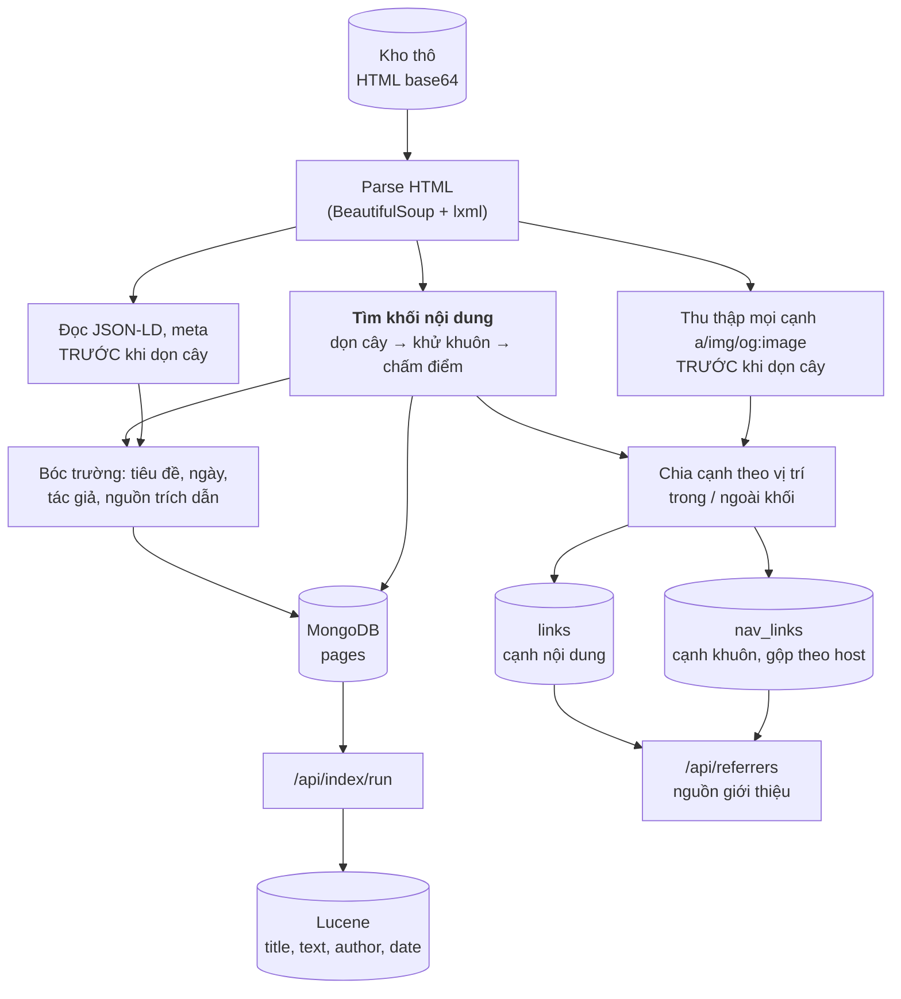
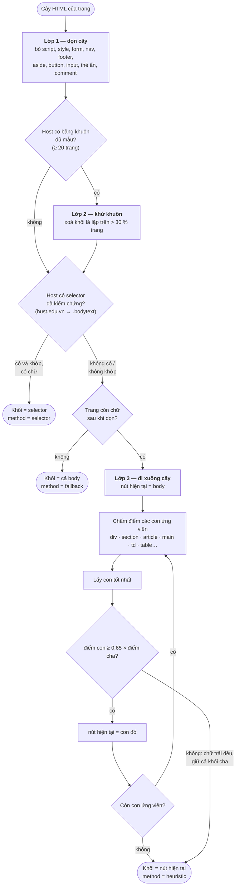
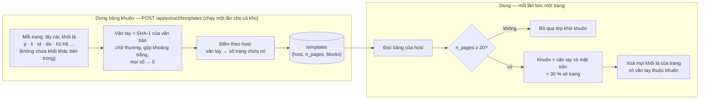
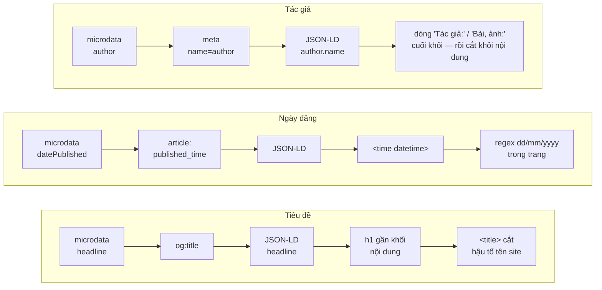
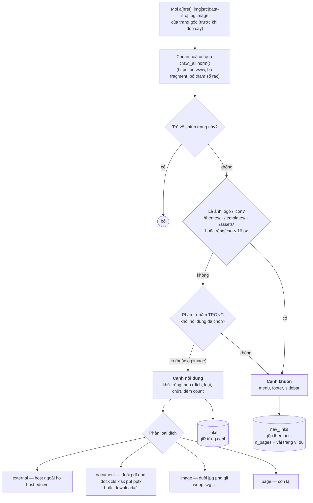
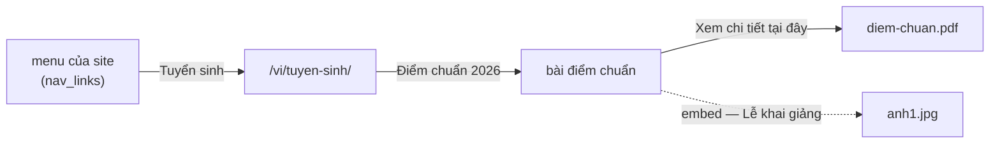
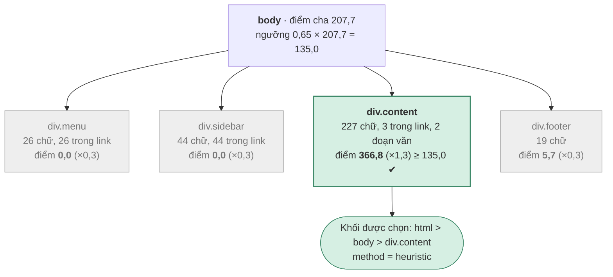
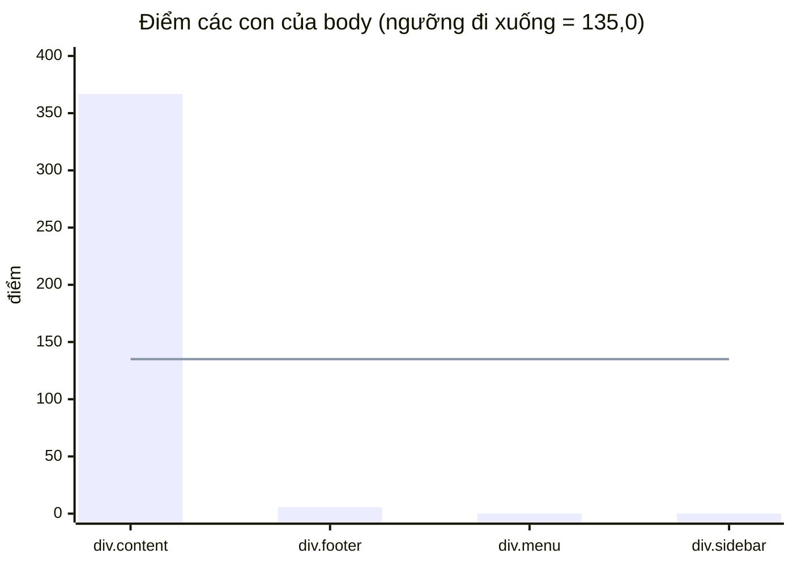

# Thuật toán bóc tách khối nội dung và xây dựng đồ thị liên kết

Tài liệu giải thích cách `hust-search/src/main/java/vn/hust/search/extract/` (bản port Java của `boc_tach/` Python, khớp 100% trên 3.438 trang kho thật) biến **một trang HTML** thành (1) khối nội
dung chính, (2) các trường tiêu đề / ngày / tác giả và (3) các cạnh `nguồn → đích : văn bản mô tả`.
Mọi con số trong ví dụ ở mục 6 lấy từ một lần chạy thật của chính code này trên một trang mẫu
nhỏ; mọi biểu đồ là Mermaid, GitHub tự vẽ.

> **Phạm vi trung thực.** Đây là các heuristic tự cài, không dùng học máy. Các hằng số (α, β, γ, δ,
> ngưỡng 30 %, 20 trang…) là **giá trị khởi điểm chưa được dò trên dữ liệu thật**. Số F1 0,96–0,98
> trong README chỉ đo trên trang tổng hợp do chúng tôi dựng (bộ mẫu tổng hợp trong `BlockEvaluationTest`), nên chỉ chứng minh
> thuật toán xử lý được các bố cục đó, không nói gì về độ chính xác trên hust.edu.vn.

Mục lục: [1. Bức tranh chung](#1-bức-tranh-chung) ·
[2. Tìm khối nội dung](#2-tìm-khối-nội-dung) · [3. Khử khuôn theo site](#3-khử-khuôn-theo-site) ·
[4. Bóc các trường](#4-bóc-các-trường) · [5. Đồ thị liên kết](#5-đồ-thị-liên-kết) ·
[6. Ví dụ chạy thật](#6-ví-dụ-chạy-thật) · [7. Độ phức tạp](#7-độ-phức-tạp) ·
[8. Điểm yếu đã biết](#8-điểm-yếu-đã-biết) · [9. Ý tưởng nền](#9-ý-tưởng-nền)

---

## 1. Bức tranh chung

Điểm mấu chốt: **khối nội dung được chọn trước, rồi mọi thứ khác dựa vào nó**. Tiêu đề, tác giả
được tìm gần khối đó; liên kết nằm trong khối là cạnh "người viết chủ động dẫn tới", nằm ngoài khối
là cạnh khuôn (menu, footer). Chọn khối sai thì cả chữ đưa vào chỉ mục lẫn đồ thị đều sai theo.



Thứ tự "thu thập cạnh và JSON-LD **trước**, dọn cây **sau**" là có chủ đích: dọn cây xoá `nav`, `footer`,
`script`, nên nếu thu thập sau thì menu và dữ liệu JSON-LD đã biến mất.

---

## 2. Tìm khối nội dung

Hàm `khoi.tim_khoi()`. Ba lớp, chạy tuần tự trên cùng một cây.



### 2.1. Lớp 1 — dọn cây (`don_cay`)

Xoá thẻ không mang nội dung đọc được: `script style noscript iframe form svg button input select nav
footer aside template`, mọi thẻ có `hidden` hoặc `style="display:none"`, và comment HTML.

### 2.2. Lớp 3 — chấm điểm nút (`_thong_ke`, `_diem`, `_he_so`)

Với mỗi nút, một lượt duyệt **từ lá lên gốc** tính bốn đặc trưng (cộng dồn từ các con):

| Ký hiệu | Ý nghĩa | Cách đếm |
|---|---|---|
| `C` | số ký tự chữ | độ dài chữ (đã gộp khoảng trắng) của mọi nút văn bản bên dưới |
| `LC` | số ký tự chữ **trong link** | phần của `C` nằm dưới thẻ `<a>` |
| `P` | số đoạn văn "thật" | thẻ `<p>` có ≥ 25 ký tự và ≥ 1 dấu câu |
| `Q` | số dấu câu | đếm `. , ; : ? ! …` |

Điểm của nút `n`:

$$
\text{điểm}(n) = \Big[(C-L_C)\cdot\big(1-\tfrac{L_C}{C}\big)^{\alpha} + \beta P + \gamma Q\Big]\times h(n)
$$

với **α = 2, β = 30, γ = 1**, và hệ số tên lớp `h(n)`:

| Điều kiện (class hoặc id khớp, không phân biệt hoa thường) | `h` |
|---|---|
| `content` · `article` · `post` · `entry` · `detail` · `bodytext` · `main` · `news-body` · `noi-dung` | **× 1,3** |
| `nav` · `menu` · `footer` · `header` · `sidebar` · `comment` · `share` · `related` · `breadcrumb` · `banner` · `widget` · `social` · `advert` · `popup` · `modal` · `pagination` · `tag` | **× 0,3** |
| còn lại | × 1 |

Ý nghĩa từng thành phần:
- `(C − LC)` — chỉ chữ **không** nằm trong link mới có giá trị: menu toàn link nên về 0.
- `(1 − LC/C)^α` — nút nhiều link bị phạt thêm theo luỹ thừa; α = 2 phạt mạnh hơn tỉ lệ tuyến tính.
- `β·P` — thưởng cho đoạn văn thật (có dấu câu, đủ dài): đặc trưng của thân bài, ít có ở menu.
- `γ·Q` — thưởng nhẹ theo số dấu câu.
- `h(n)` — dùng tên lớp làm tín hiệu phụ, không phải tín hiệu duy nhất.

### 2.3. Vòng đi xuống

Bắt đầu ở `<body>`. Mỗi bậc: chấm điểm các con ứng viên, chọn con có điểm cao nhất, và **chỉ đi xuống
nếu con đó giữ ≥ δ = 65 % điểm của cha**. Nếu không, chữ đang trải đều qua nhiều con (ví dụ trang
danh sách) nên giữ nguyên khối cha thay vì chọn một mảnh nhỏ. Vòng dừng khi hết con ứng viên hoặc
ngưỡng δ không đạt.

> Lưu ý: điểm của con đã nhân `h` còn điểm của cha thì **không** — một con có tên lớp `content` được
> lợi 30 % khi so với ngưỡng. Đây là chi tiết cài đặt hiện tại, không phải lựa chọn đã được kiểm chứng.

---

## 3. Khử khuôn theo site

Lớp `Template.java`. Ý tưởng: menu, footer, banner **lặp gần nguyên xi trên mọi trang** của cùng một site,
còn thân bài thì khác nhau. Có cả kho trang của host nên đếm được khối nào lặp.



Thay mọi số bằng `0` trong vân tay để các khối chỉ khác nhau ở con số (ngày giờ, số lượt xem, số
trang) vẫn được coi là cùng một khối. Hệ quả cần biết: hai khối thật sự khác ý nghĩa nhưng chỉ khác
con số cũng bị coi là giống nhau.

Bảng lưu vào Mongo chỉ giữ vân tay có mặt trên ≥ max(3, 5 % số trang) để một document không vượt
giới hạn 16 MB; ngưỡng 30 % luôn cao hơn nên kết quả khử khuôn không đổi.

---

## 4. Bóc các trường

Lớp `Fields.java`. Mỗi trường là một **chuỗi nguồn theo thứ tự ưu tiên** và trả kèm tên nguồn đã
dùng (`*_src`), để đo trường nào đang lấy được từ đâu.



Chi tiết đáng nhớ:
- **Bỏ giá trị chung** như `admin`, `administrator`, `webmaster` ở nguồn microdata / meta / JSON-LD
  (đó là tài khoản đăng bài, không phải tác giả).
- **Dòng tác giả / nguồn bị cắt khỏi nội dung** (`dong_tac_gia_nguon`): tìm ≤ 8 phần tử ngắn (≤ 130 ký
  tự) cuối khối khớp `Tác giả:`, `Người viết:`, `Tin, ảnh:`, `Bài, ảnh:`… rồi xoá chúng, để tên người
  viết không lọt vào chỉ mục như chữ của bài.
- **Nguồn trích dẫn** (`cited_source`) là trường phụ, lấy từ dòng `Nguồn: …` hoặc `Theo …`. Chỉ xét các
  phần tử **ngắn (≤ 130 ký tự)** ở cuối khối, nên đoạn văn dài bắt đầu bằng "Theo kế hoạch…" không bị
  nhận nhầm (có test). Nhưng một đoạn văn **ngắn** bắt đầu bằng "Theo …" ở cuối bài vẫn có thể bị nhận nhầm
  là nguồn và bị cắt khỏi nội dung.
- **Ngày** luôn chuẩn hoá về `YYYY-MM-DD`; ngày không tồn tại (31/02) bị loại.
- **Cắt hậu tố tên site** ở `<title>` chỉ khi đoạn cuối ≤ 40 ký tự và phần còn lại ≥ 10 ký tự — heuristic,
  có thể cắt nhầm.

---

## 5. Đồ thị liên kết

Lớp `Links.java`. Mỗi cạnh là `nguồn → đích : văn bản mô tả`. Với ba loại đối tượng của đề bài:

| Đối tượng | Cạnh | Văn bản mô tả |
|---|---|---|
| Trang | `<a href>` trỏ tới trang | chữ trong `<a>` → `title` → `aria-label` → `alt` của ảnh con |
| Tệp tài liệu | `<a href>` trỏ tới pdf/docx/… | như trên |
| Ảnh | ``, `data-src`, `og:image` | `alt` → `title` → `figcaption` |



### Vì sao tách hai loại cạnh

| | Cạnh nội dung | Cạnh khuôn |
|---|---|---|
| Nằm ở | trong khối nội dung | ngoài khối, lặp trên nhiều trang |
| Ý nghĩa | người viết **chủ động** giới thiệu đích | cấu trúc điều hướng của site |
| Số lượng | vài đến vài chục mỗi trang | cả trăm mỗi trang × mọi trang |
| Lưu | từng cạnh một (`links`) | **một bản mỗi host**, kèm `n_pages` (`nav_links`) |

Nếu lưu cạnh menu theo từng trang thì mỗi link menu thành hàng nghìn cạnh giống hệt, và "nguồn giới
thiệu" của `/vi/tuyen-sinh/` là một danh sách hàng nghìn trang không ai đọc nổi. Gộp theo host cho
ra câu đọc được: *"menu của hust.edu.vn, chữ 'Tuyển sinh', có trên N trang"*.

### Nguồn giới thiệu là đọc ngược cạnh

Không có thuật toán riêng: "nguồn giới thiệu" của một trang / tệp / ảnh chính là **các cạnh đi vào nó**.



Đọc ngược mũi tên: `diem-chuan.pdf` được giới thiệu bởi bài điểm chuẩn bằng chữ "Xem chi tiết tại
đây"; bài đó được giới thiệu bởi trang `/vi/tuyen-sinh/`; trang đó được giới thiệu bởi menu cả site.
Truy vấn tương ứng:

```js
db.links.find({dst: "<url>"}, {src: 1, text: 1})                    // người viết trỏ tới
db.nav_links.find({dst: "<url>"}, {host: 1, text: 1, n_pages: 1})   // menu / footer trỏ tới
```

Các url bí danh (bài xuất hiện dưới nhiều chuyên mục) được gộp qua `crawl_all.dedup_key()` (đoạn cuối
đường dẫn) và `/api/referrers` tự đổi bí danh về trang chính trước khi tra.

---

## 6. Ví dụ chạy thật

Trang mẫu `https://svbk.hust.edu.vn/tin/hb-1.html` (HTML dài 1 kB, tự viết; **không phải trang thật**):

```html
<div class="menu">  Trang chủ · Tuyển sinh · Liên hệ  </div>
<div class="sidebar"> Tin A dài dòng tiêu đề · Tin B dài dòng tiêu đề </div>
<div class="content">
  <h1>Thông báo học bổng năm 2026</h1>
  <p>Viện thông báo chương trình học bổng … hạn nộp hồ sơ là cuối tháng chín.</p>
  <p>Sinh viên tải mẫu đơn tại <a href="/uploads/hb.pdf">đây</a> và nộp tại văn phòng viện.</p>
  <p>Tác giả: Trần Thị B</p>
</div>
<div class="footer"> Copyright Viện CNTT </div>
```

Cây DOM và điểm từng nút (số liệu `giai_thich()` trả về):



Điểm các con ứng viên so với ngưỡng đi xuống:



Phễu số chữ qua từng lớp:

| Bước | Chữ còn lại | Ghi chú |
|---|---:|---|
| Toàn trang | 316 | |
| Sau dọn cây | 316 | không có script/form để bỏ |
| Sau khử khuôn | 316 | host chưa có bảng khuôn đủ mẫu |
| **Khối được chọn** | **227** | bỏ menu, sidebar, footer |

Kết quả bóc trường: tiêu đề `Thông báo học bổng năm 2026` (nguồn `h1`), tác giả `Trần Thị B` (nguồn
`text-line`, dòng này bị cắt khỏi nội dung). Cạnh:

| Đích | Loại | Chữ mô tả | Vào bảng |
|---|---|---|---|
| `…/uploads/hb.pdf` | href · document | đây | `links` (trong khối) |
| `…/uploads/anh.jpg` | embed · image | Lễ trao học bổng | `links` (trong khối) |
| `…/` , `…/tuyen-sinh/`, `…/lien-he/` | href · page | Trang chủ, Tuyển sinh, Liên hệ | `nav_links` (ngoài khối) |
| `…/tin/a.html`, `…/tin/b.html` | href · page | Tin A…, Tin B… | `nav_links` (ngoài khối) |

2 cạnh nội dung, 5 cạnh khuôn.

---

## 7. Độ phức tạp

Gọi `N` là số nút DOM của một trang, `E` là số cạnh, `B` là số khối lá.

| Bước | Chi phí | Ghi chú |
|---|---|---|
| Parse HTML | O(kích thước HTML) | chiếm phần lớn thời gian |
| Thống kê `C, LC, P, Q` | O(N) | một lượt từ lá lên gốc |
| Đi xuống cây | O(N) xấu nhất | mỗi bậc chỉ xét con trực tiếp |
| Khử khuôn một trang | O(B) | băm SHA-1 từng khối lá |
| Dựng bảng khuôn cả kho | O(tổng B) | một lượt qua kho, chạy một lần |
| Chia cạnh | O(N + E) | tập `id` của các nút trong khối |

Chưa đo thời gian thật trên kho 6.000 trang; chỉ biết lượt bóc 150 trang mẫu tổng hợp mất vài giây.

---

## 8. Điểm yếu đã biết

1. **Trang danh sách / chuyên mục** (nhiều link, ít đoạn văn): điểm bị phạt mật độ link nên thuật toán
   có thể chọn một khối con rất nhỏ, thậm chí chỉ một dòng ngày tháng. Báo cáo so sánh trên 300 trang
   thật đã cho thấy hiện tượng này ở các trang `hoat-dong-hop-tac`, `tin-tuc-hoc-bong/page-N`.
2. **Trang bọc toàn bộ trong `<form>`** (kiểu ASP.NET): lớp 1 xoá cả thẻ `form` cùng mọi thứ bên trong,
   khiến trang không còn chữ. Đã tái hiện trên trang mẫu; **chưa xác nhận** đây là nguyên nhân của ba
   trang `fallback` 0 ký tự trong báo cáo trên.
3. **Khử khuôn cần ≥ 20 trang mỗi host.** Subdomain mới crawl vài trang không được hưởng lớp này.
4. **Vân tay bỏ qua con số** nên coi hai khối chỉ khác con số là một.
5. **Điểm cha không nhân `h`, điểm con có nhân** (xem ghi chú ở mục 2.3).
6. **Trang dựng bằng JavaScript** không có chữ trong HTML tải về; phải render bằng trình duyệt ở tầng
   crawl (`render.py`, chỉ chạy trên máy host: image docker đã bỏ Playwright).
7. **Cạnh khuôn riêng cho từng trang** (ví dụ khối "tin liên quan" nằm ngoài khối nội dung nhưng khác
   nhau theo trang) vẫn vào `nav_links` dưới dạng nhiều dòng `n_pages = 1`; chưa đo `nav_links` phình
   đến đâu trên kho thật.

Cách kiểm tra từng trang: tab **Bóc tách khối** trên giao diện (`POST /api/extract/url`) cho xem nội
dung và liên kết đã bóc của một url bất kỳ; `GET /api/extract/explain?url=` trả số liệu từng bậc ở mục 2. Công cụ so chỉ mục bóc cũ với bóc mới (`so_sanh.py`) đã bỏ cùng bản Python.

---

## 9. Ý tưởng nền

Thuật toán lấy cảm hứng từ ba họ ý tưởng đã công bố. **Tên bài và năm dưới đây tôi ghi theo trí nhớ,
cần kiểm lại trước khi đưa vào báo cáo chính thức**; đây là bản đơn giản hoá tự cài, không phải cài
lại đúng các bài đó.

| Ý tưởng | Dùng ở đâu | Nguồn (cần kiểm lại) |
|---|---|---|
| Mật độ chữ và mật độ link trên DOM để phân biệt nội dung với rác | lớp 3, công thức điểm | CETD — Sun, Song, Liao, SIGIR 2011; Boilerpipe — Kohlschütter và cs., WSDM 2010 |
| Khối lặp trên cả site là khuôn mẫu | lớp 2 | Site Style Tree — Yi, Liu, Li, KDD 2003 |
| Chấm điểm đoạn văn theo dấu câu, tên lớp | `P`, `Q`, hệ số `h` | họ Readability (Arc90 / Mozilla) |

Các thư viện bóc nội dung có sẵn (trafilatura, readability-lxml, boilerpy3, jusText) là cùng họ ý
tưởng; đề bài yêu cầu tự cài thuật toán nên chúng được dùng làm **mốc so sánh**, không thay thế.

## Tệp liên quan

| Việc | File |
|---|---|
| Chọn khối nội dung | `extract/ContentBlock.java` |
| Khử khuôn theo host | `extract/Template.java` |
| Bóc trường | `extract/Fields.java` |
| Đồ thị, chia cạnh | `extract/Links.java` |
| Điều phối một trang | `extract/Extractor.java` (`extract`, `explain`), `HtmlUtil.java` |
| Lưu Mongo, chạy cả kho | `mongo/Pipeline.java`, `web/ApiExtract.java` |
| Lược đồ Mongo | `SCHEMA.md`, `mongo/Db.java`, `mongo-schema.json` |
| Kế hoạch và quyết định | `KE-HOACH-BOC-TACH.md` |
| Đo và so sánh | `BlockEvaluationTest.java`, `PythonParityTest.java` (so với bản Python) |
